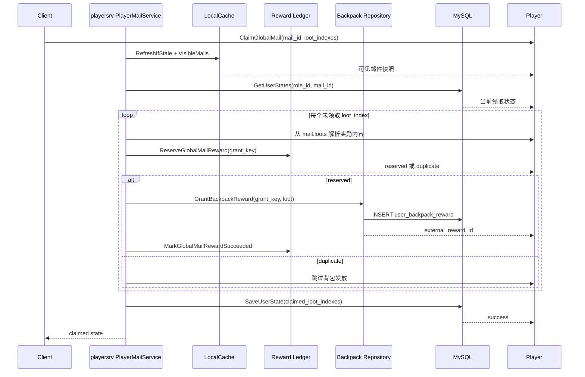

# 背包奖励设计

本文描述全局邮件领取奖励时的背包发放设计。当前实现把背包相关能力放在 `playersrv` 内部：`playersrv` 接收玩家领取请求，完成邮件可见性校验、奖励幂等账本预占、背包发放明细落库和邮件领取状态更新。

## 设计目标

- 背包发放属于玩家在线业务写路径，应由 `playersrv` 编排，避免把玩家状态修改散落到管理端或 outbox relay。
- 同一玩家、同一全局邮件、同一奖励下标只能发放一次。
- 客户端重复点击、网络重试、`playersrv` 保存状态失败后的重试，都不能重复增加背包物品。
- 邮件读取可以依赖本地缓存，但领取奖励必须重新校验可见性并写入权威存储。
- 当前先使用 MySQL 持久化背包发放明细；未来如果接入独立背包服务，仍沿用稳定发放流水。

## 职责边界

| 模块 | 职责 |
| --- | --- |
| `app/playersrv.PlayerMailService` | 处理领取请求，校验邮件可见性，解析目标 `loot_index`，更新玩家邮件状态 |
| `app/playersrv.BackpackRewardService` | 编排奖励账本和背包发放，保证发放流程幂等 |
| `domain/globalmail.RewardLedgerRepository` | 预占奖励流水，记录成功、失败和外部发放流水 |
| `domain/globalmail.BackpackRepository` | 执行背包发放，目前由 MySQL repository 写入背包发放明细 |
| `data/mysql.Repository` | 保存玩家邮件状态、奖励账本和 `user_backpack_reward` 明细 |

不属于背包设计范围的能力：

- 管理端发布全局邮件。
- Outbox Relay 同步全局邮件缓存。
- Redis 本地缓存刷新。
- 独立背包服务的网络协议和补偿 worker。

## 核心数据模型

### 奖励账本

`user_global_mail_reward_ledger` 是全局邮件奖励发放的幂等账本，主键是 `grant_key`。

`grant_key` 生成规则：

```text
{role_id}:{global_mail_id}:{loot_index}
```

账本字段含义：

- `role_id`：领取奖励的角色。
- `global_mail_id`：全局邮件 ID。
- `loot_index`：邮件 `loots` 数组中的奖励下标。
- `status`：发放状态，当前使用 `pending`、`succeeded`、`failed`。
- `external_reward_id`：背包发放明细或未来外部背包服务返回的流水。
- `failure_reason`：背包发放失败原因，便于排查和补偿。

### 背包发放明细

`user_backpack_reward` 保存当前 `playersrv` 内置背包发放结果，主键同样是 `grant_key`。

关键字段：

- `grant_key`：背包发放幂等流水。
- `role_id` / `server_id`：玩家定位信息。
- `loot_index`：本次发放的奖励下标。
- `loot`：从全局邮件 `loots` 中取出的奖励内容快照。
- `create_time`：发放明细创建时间。

当前 `external_reward_id` 使用 `playersrv-backpack:{grant_key}`，用于把奖励账本和背包发放明细串起来。

## 领取奖励流程



流程说明：

1. `playersrv` 收到领取请求后，先刷新本地缓存并确认目标邮件对当前玩家可见。
2. `playersrv` 读取玩家邮件状态，过滤已经领取过的 `loot_index`。
3. 对每个未领取奖励，按 `loot_index` 从全局邮件 `loots` 中取出奖励内容。
4. `BackpackRewardService` 先写奖励账本，账本写入成功才继续发放背包奖励。
5. 背包发放明细使用同一个 `grant_key` 做主键，重复请求不会重复插入。
6. 背包发放成功后，奖励账本更新为 `succeeded`，并记录 `external_reward_id`。
7. 所有新奖励处理完成后，`PlayerMailService` 保存玩家邮件领取状态。

## 幂等策略

| 场景 | 幂等保护 | 结果 |
| --- | --- | --- |
| 客户端重复点击领取 | `ClaimedLootIndexes` 过滤已领取下标 | 已领取奖励不会再次调用背包发放 |
| 首次发放后保存邮件状态失败 | `grant_key` 奖励账本唯一键 | 重试时账本命中，不重复写背包 |
| 背包发放明细重复写入 | `user_backpack_reward.grant_key` 主键 | 只保留一条背包发放明细 |
| 不同请求号领取同一奖励 | `role_id + global_mail_id + loot_index` | 不依赖请求号，业务上仍只发一次 |
| 非法 `loot_index` | `PlayerMailService` 校验数组范围 | 返回错误，不写账本和背包 |

请求级幂等和奖励级幂等是两层保护：

- 请求级幂等用于处理同一个客户端请求的重放，缓存请求 hash 和响应摘要。
- 奖励级幂等用于处理同一业务奖励的重复领取，即使请求号不同也不能重复发奖。

## 失败处理

### 背包发放失败

如果背包发放返回错误：

1. `BackpackRewardService` 将奖励账本标记为 `failed`。
2. `ClaimGlobalMail` 返回错误。
3. 玩家邮件状态不会写成已领取。

后续可以按 `status = failed` 的账本记录做人工排查或补偿任务。

### 账本成功但状态保存失败

如果背包发放成功，但 `SaveUserState` 失败：

1. 奖励账本已经是 `succeeded`。
2. 背包发放明细已经存在。
3. 客户端重试时，`ReserveGlobalMailReward` 会命中奖励账本唯一键。
4. `playersrv` 跳过背包发放，只补写玩家邮件领取状态。

这保证了“奖励已发但状态未保存”的异常不会导致重复发奖。

### 未来接入独立背包服务

如果以后背包服务从 `playersrv` 内置实现拆成独立服务，应保持以下规则不变：

- 调用外部背包服务时必须传入同一个 `grant_key`。
- 外部背包服务必须按 `grant_key` 幂等。
- `external_reward_id` 记录外部服务返回流水。
- 失败账本需要由补偿任务扫描并处理。
- 不应绕过 `BackpackRewardService` 直接在 `PlayerMailService` 里调用外部接口。

## 当前代码落点

- `app/playersrv/backpack_service.go`：背包奖励发放编排。
- `app/playersrv/mail_service.go`：领取邮件、解析 `loots`、调用奖励服务。
- `domain/globalmail/ports.go`：奖励账本和背包 repository 接口。
- `domain/globalmail/types.go`：`RewardGrant` 和 `BackpackGrant` 数据结构。
- `data/mysql/repository.go`：奖励账本和背包发放明细的 MySQL 实现。
- `data/sqlschema/globalmail.go`：`user_global_mail_reward_ledger` 和 `user_backpack_reward` 建表语句。
- `cmd/playersrv/main.go`：组装 `BackpackRewardService`。

## 后续演进

- 增加失败账本扫描和补偿任务。
- 给背包发放成功、失败、重复命中增加监控指标。
- 如果背包物品结构稳定，可以把 `loot` JSON 拆成更明确的物品 ID、数量、类型字段。
- 接入独立背包服务时，补充超时、重试、熔断和查询外部流水的恢复能力。
