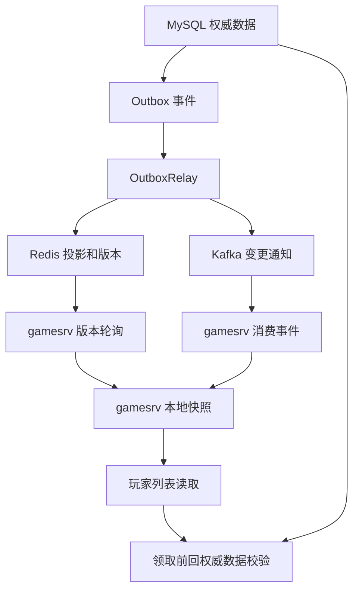
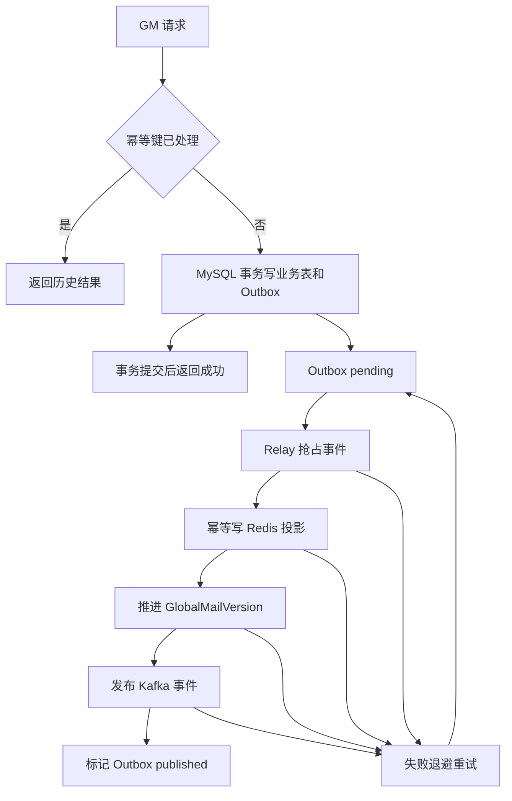
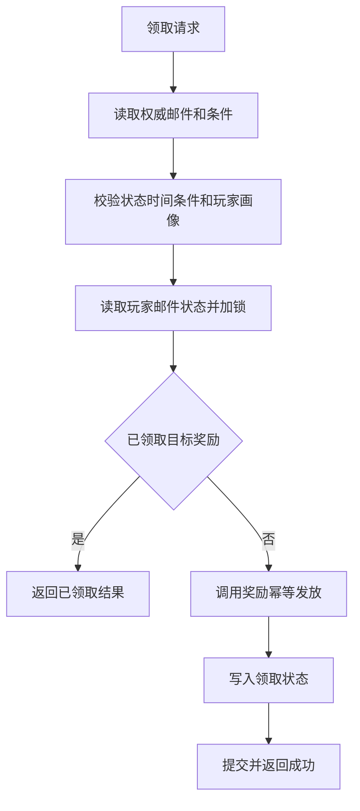

# 全局邮件数据一致性与幂等性方案

> 文档定位：定义全局邮件在发布、缓存刷新、事件通知、玩家读取和领取链路中的一致性边界与幂等规则。业务需求和表结构见 `requirements-design.md`，部署和监控见 `deployment-plan.md`。

## 1. 目标和原则

全局邮件面向大量玩家，发布和读取链路不能依赖分布式事务，也不能要求 Redis、Kafka 和每台 `gamesrv` 与 MySQL 每一刻都完全同步。本方案的核心思路是：**先把正确数据写进 MySQL，再用 outbox 慢慢把缓存和通知补齐；任何重复执行都不能造成重复副作用。**

先把几个词说清楚：

- 权威数据：最终以谁为准。这里以 MySQL 为准，Redis、Kafka、`gamesrv` 本地缓存都不能替代 MySQL 判断最终结果。
- 投影：为了读得更快，从 MySQL 数据整理出来的一份缓存副本。Redis 里的邮件详情、索引和版本就是投影；投影丢了可以重建。
- 事件通知：告诉其他服务“数据变了”。Kafka 事件只负责提醒 `gamesrv` 去刷新，不负责保存完整邮件，也不负责判断最终状态。
- 版本号：判断缓存新旧的尺子。`gamesrv` 只要发现自己的本地版本小于 Redis 的 `GlobalMailVersion`，就知道需要刷新。
- 最终一致：短时间内某台 `gamesrv` 可以落后，但只要 MySQL 数据存在、outbox 能重试、版本能被轮询，最终会刷新到最新状态。
- 幂等：同一个操作执行一次和执行多次，结果应该一样。比如重复领取同一封邮件，只能返回“已领取”，不能重复发奖。

核心目标：

- 邮件发布成功后，MySQL 中一定存在权威业务数据和可重试的 outbox 事件。
- Redis、Kafka、`gamesrv` 本地缓存可以延迟，但必须能通过 outbox 重试、版本轮询或回源 MySQL 最终收敛。
- 任何可能重复发生的操作都必须有幂等键、唯一约束或版本判断。
- 玩家领取奖励必须防止重复发奖，不能只依赖缓存判断成功。
- 请求超时、服务重启、Kafka 重复消息、Outbox Relay 重试都不能造成错误状态或重复副作用。

## 2. 一致性分层

| 层级 | 组件 | 它负责什么 | 出问题时怎么办 |
| --- | --- | --- | --- |
| L0 权威层 | MySQL | 保存真正可信的邮件、条件、玩家状态、outbox 和幂等记录 | 写失败就认为业务失败；其他层都以它为准 |
| L1 缓存层 | Redis | 保存方便读取的邮件副本、索引和全局版本号 | 可以延迟或丢失，必要时从 MySQL 重建 |
| L2 通知层 | Kafka | 通知每台 `gamesrv`“全局邮件有变化” | 允许重复、乱序或延迟，消费端用版本号判断 |
| L3 本地层 | `gamesrv` 内存 | 保存当前进程使用的邮件快照，支撑高频列表读取 | 可以短暂落后；领取前必须回权威数据校验 |

整体链路可以理解为“先落库，再同步缓存，再通知刷新”：业务事务先写 MySQL 和 outbox；Outbox Relay 读取 outbox，把 MySQL 中的邮件整理成 Redis 缓存，并发布 Kafka 通知；`gamesrv` 收到通知或轮询发现版本落后后，刷新自己的本地快照。玩家列表读取可以用本地快照降低压力，但领取前必须回到 MySQL 或权威奖励服务做二次校验，避免缓存延迟导致错误发奖。



边界原则：

- MySQL 是最终答案；如果缓存和 MySQL 不一致，以 MySQL 为准。
- Redis 是为了读得快；Redis 数据丢了或旧了，可以从 MySQL 重建。
- Kafka 是为了通知得快；漏收 Kafka 不代表永远不同步，`gamesrv` 还会轮询版本号。
- `GlobalMailVersion` 是判断新旧的依据；`gamesrv` 不靠“有没有收到某条消息”判断自己是否最新。
- `gamesrv` 可以短时间用旧快照服务列表读取，但领取、删除、发奖等写路径必须回 MySQL 或权威服务。

## 3. 写入成功边界

GM 发布、更新、下线和删除都按同一模型处理：

文字流程：

1. GM 请求进入后先检查幂等键；如果同一个请求已经成功处理，直接返回历史结果。
2. 首次请求在一个 MySQL 事务内写业务表、条件表、幂等记录和 outbox 事件。
3. MySQL 事务提交后，接口即可返回成功，不等待 Redis、Kafka 或所有 `gamesrv` 刷新。
4. Outbox Relay 后台抢占 `pending` 事件，按版本幂等写 Redis 投影，并推进 `GlobalMailVersion`。
5. Redis 投影完成后发布 Kafka 事件，通知每台 `gamesrv` 检查并刷新本地缓存。
6. Redis 或 Kafka 任一步失败，事件保持可重试状态；Relay 后续重放同一事件，依靠幂等规则避免重复副作用。
7. Kafka 消息重复或乱序到达时，`gamesrv` 只按版本判断是否需要刷新；即使 Kafka 延迟，版本轮询也会让本地缓存最终收敛。



成功边界：

- GM 接口成功：MySQL 事务提交成功，包含 `GlobalMail`、`GlobalMailCondition`、`GlobalMailOutboxEvent` 和发布幂等记录。
- 缓存投影成功：Outbox Relay 已把对应版本写入 Redis 详情和索引，并推进 `GlobalMailVersion`。
- 通知成功：Kafka 已收到 `GlobalMailChanged` 事件。
- 本地可见：目标 `gamesrv` 通过 Kafka 或轮询看到新版本，并刷新本地快照。

GM 接口不等待 Redis、Kafka 或所有 `gamesrv` 刷新完成。这样可以避免外部依赖抖动扩大 MySQL 写事务，同时依靠 outbox 保证后续可恢复。

## 4. Outbox Relay 状态机

Outbox 表承担“业务数据已提交但异步通知尚未完成”的恢复凭据。建议状态如下：

| 状态 | 含义 | 可执行动作 |
| --- | --- | --- |
| `pending` | 待投递或可重试 | Relay 抢占处理 |
| `processing` | 已被某个 Relay 实例锁定 | 超时后回到 `pending` |
| `published` | Redis 投影、版本推进和 Kafka 投递已完成 | 不再处理 |
| `failed` | 达到最大重试或不可解析 | 人工修复或重放 |

抢占规则：

- 多个 Relay 实例部署时，必须通过行锁、租约字段或条件更新抢占事件。
- 抢占条件需要包含当前状态和锁过期时间，避免两个实例同时处理同一行。
- Relay 重启后，超过锁 TTL 的 `processing` 事件回到 `pending`。

重试规则：

- 可恢复错误，如 Redis 超时、Kafka 暂不可用，回到 `pending` 并设置 `next_retry_time`。
- 不可恢复错误，如 payload 无法反序列化，进入 `failed` 并记录失败原因。
- 达到最大重试次数后进入 `failed`，由后台工具人工修复、跳过或重放。
- 重试必须安全，因为 Redis 投影、版本推进和 Kafka 消费都按幂等规则处理。

## 5. 幂等操作清单

| 操作 | 幂等键或判断 | 重复执行结果 | 关键约束 |
| --- | --- | --- | --- |
| GM 发布 | `idempotency_key` 或 `operator_id + request_id` | 返回第一次创建的 `global_mail_id` 和版本 | 幂等记录与业务表同事务 |
| GM 更新/下线/删除 | `global_mail_id + expected_version + action_id` | 已执行则返回当前目标版本 | 使用版本防并发覆盖 |
| Outbox 处理 | `event_id` | 已发布则跳过；处理中超时可重试 | `event_id` 唯一 |
| Redis 投影 | `aggregate_id + version` | 旧版本不覆盖新版本，同版本重复写无副作用 | 投影中保存版本 |
| 版本推进 | 目标版本大于当前版本才推进 | 重复推进不倒退 | `GlobalMailVersion` 单调 |
| Kafka 投递 | `event_id` | 允许重复投递 | 消费端按版本判旧 |
| Kafka 消费 | `event.version <= local.version` | 忽略重复或乱序事件 | 本地快照保存版本 |
| 列表读取 | 读请求天然幂等 | 返回当前可见快照 | 不产生副作用 |
| 标记已读 | `role_id + global_mail_id` | 返回当前状态 | 删除态不能被已读覆盖 |
| 删除状态 | `role_id + global_mail_id` | 返回删除态 | 删除时间只首次写入 |
| 领取奖励 | `role_id + global_mail_id + loot_index` 或奖励流水号 | 返回已领取结果 | 发奖和状态必须幂等 |
| 请求重试 | `uid + command_id + request_seq` | 返回历史执行结果 | 超时后不能重复副作用 |

## 6. 发布幂等

GM 后台或管理接口必须生成稳定的 `idempotency_key`。同一次用户提交、浏览器重试、网关重试或后台任务重放，都应携带同一个 key。

建议记录：

```text
GlobalMailIdempotency
- idempotency_key
- action
- request_hash
- global_mail_id
- target_version
- status: processing/succeeded/failed
- response_snapshot
- create_time
- update_time
```

处理规则：

- 首次请求：在 MySQL 事务内写幂等记录、业务表和 outbox。
- 重复请求且 `request_hash` 相同：返回第一次成功结果；如果仍在 `processing`，返回处理中或等待短时间后再查。
- 重复请求但 `request_hash` 不同：返回冲突错误，避免同一个 key 被不同内容复用。
- 事务失败：不写成功结果，允许调用方使用同一个 key 重试。

## 7. Redis 投影和版本幂等

Redis 投影包括邮件详情、活跃索引、区服索引和 `GlobalMailVersion`。它们不是权威数据，但必须防止旧事件覆盖新事件。

投影规则：

- `GlobalMail:{globalMailId}` 保存邮件内容和 `version`。
- `GlobalMailActiveIndex`、`GlobalMailByServer:{serverID}` 的更新以事件版本为判断依据。
- Relay 处理事件时，先读取当前投影版本；如果当前版本高于事件版本，直接跳过投影写入。
- 同版本重复执行必须得到相同投影结果。
- `GlobalMailVersion` 使用“推进到目标版本”的语义，只有 `target_version > current_version` 时更新。

推荐顺序：

```text
1. 从 MySQL 读取目标 global_mail_id 的权威数据和条件。
2. 按事件 action 构造 Redis 投影。
3. 使用版本条件写入详情和索引。
4. 推进 GlobalMailVersion。
5. 发布 Kafka 事件。
6. 标记 outbox published。
```

如果第 4 步之后第 5 步失败，Relay 重试会再次执行第 1 到 5 步。由于投影和版本推进幂等，重复执行不会产生错误；Kafka 最终成功后，`gamesrv` 通过事件或轮询收敛。

## 8. Kafka 消费和本地缓存幂等

每台 `gamesrv` 都需要收到全局邮件变更事件，因此每台实例应使用独立 consumer group 或稳定实例 ID 对应的订阅语义。

消费规则：

- 事件 payload 只包含 `event_id`、`global_mail_id`、`version`、`action` 和时间戳。
- 收到事件后，先比较 `event.version` 与本地快照版本。
- `event.version <= local.version` 时直接确认并忽略。
- `event.version > local.version` 时触发刷新，从 Redis 加载目标版本快照。
- Redis 缺失或版本不足时，受控回源 MySQL 重建 Redis 和本地快照。
- Kafka 延迟或丢失时，后台定时轮询 `GlobalMailVersion` 兜底。

刷新要求：

- 使用 singleflight 防止同一实例内并发刷新。
- 构建完整新快照后原子替换，避免请求读到半成品。
- 刷新失败不清空旧快照，保留列表读取能力。
- 旧快照只允许服务读路径；领取和状态写入必须二次校验权威数据。

## 9. 玩家状态和领取幂等

玩家状态表以 `role_id + global_mail_id` 为唯一键，表示玩家对某封全局邮件的个人状态。状态写入不能只依赖缓存中的可见结果。

状态流转建议：

```text
unread -> read -> claimed -> deleted
unread -> claimed -> deleted
read -> deleted
claimed -> deleted
```

状态保护规则：

- `deleted` 是终态之一，重复已读不能把 `deleted` 改回 `read`。
- `claimed` 表示奖励已经全部领取，重复领取返回已领取结果。
- 部分领取时使用 `claimed_loot_indexes` 记录已领取下标，重复领取相同下标不再发奖。
- 并发更新使用版本号或数据库条件更新，避免后写请求覆盖先写的终态。

领取流程：

文字流程：

1. 收到领取请求后，先读取 MySQL 中的权威邮件、条件和当前时间状态，不能只信本地缓存中的可见列表。
2. 重新读取玩家关键画像并校验区服、注册时间、动态条件、邮件有效期和邮件状态。
3. 读取玩家邮件状态并加锁，或使用版本条件更新，防止同一玩家并发点击覆盖状态。
4. 如果目标奖励已经领取，直接返回已领取结果；这属于正常幂等命中，不应再次调用发奖。
5. 如果尚未领取，使用稳定奖励流水调用奖励账本或奖励服务，保证重复调用不会重复发奖。
6. 发奖成功后写入或更新 `UserGlobalMailState`，记录已领取奖励下标和领取时间。
7. 如果发奖成功但状态保存失败，后续必须能按奖励流水补写状态或进入补偿流程。



奖励发放有两种推荐模型：

- 同库事务模型：奖励账本和 `UserGlobalMailState` 在同一个 MySQL 事务内写入，奖励流水唯一键为 `role_id + global_mail_id + loot_index`。
- 独立奖励服务模型：`ClaimGlobalMail` 调用奖励服务时传入稳定业务流水号，奖励服务按流水号幂等；本服务记录奖励服务返回的流水和状态。

如果奖励服务调用成功但本服务保存状态失败，必须能通过奖励流水查询并补写状态，或者通过本服务 outbox 驱动补偿。不能简单重试一个无幂等键的发奖接口。

## 10. 请求超时和重试幂等

`gatesrv`、客户端或上游系统看到 `504` 时，不能假设业务没有执行。写请求必须支持请求级幂等。

建议每个写命令携带：

```text
uid
role_id
command_id
request_seq
business_id
request_hash
```

处理规则：

- `uid + command_id + request_seq` 唯一确定一次客户端写请求。
- 首次执行前写入请求幂等记录，执行成功后保存响应摘要。
- 重复请求且内容一致时返回历史响应。
- 重复请求但内容不一致时返回冲突错误。
- 对领取这类业务，还要叠加业务幂等键，防止不同请求号重复领取同一奖励。

请求级幂等解决“同一个请求重试”的问题，业务级幂等解决“不同请求重复做同一业务动作”的问题，两者不能互相替代。

## 11. 异常场景和恢复矩阵

| 场景 | 中间状态 | 恢复机制 | 幂等要求 |
| --- | --- | --- | --- |
| MySQL 事务失败 | 无业务数据或事务回滚 | 返回失败，调用方可重试 | 同 key 重试不产生脏数据 |
| MySQL 成功后 Redis 未更新 | outbox 仍为 `pending` | Relay 重试写 Redis | Redis 投影按版本幂等 |
| Redis 写成功后 Kafka 失败 | Redis 已可见，Kafka 未通知 | Relay 重试 Kafka；gamesrv 轮询版本 | Kafka 重复投递安全 |
| Kafka 成功后 MarkPublished 失败 | 事件可能重复发布 | Relay 重试并再次投递 | 消费端按版本忽略重复 |
| Relay 处理中崩溃 | outbox 处于 `processing` | 锁超时回到 `pending` | Relay 重入安全 |
| Kafka 消息乱序 | 旧事件晚到 | 本地版本判断忽略 | `event.version` 必须可靠 |
| Redis 丢失详情 key | 版本存在但详情缺失 | singleflight 回源 MySQL 重建 | 回源重建可重复 |
| gamesrv 刷新失败 | 本地快照落后 | 保留旧快照，继续轮询重试 | 领取回权威校验 |
| 玩家重复点击领取 | 多次领取请求 | 状态锁和奖励流水去重 | 不重复发奖 |
| 领取成功后响应超时 | 客户端认为失败 | 请求幂等返回历史结果 | 保存响应或可重算 |
| 奖励成功但状态保存失败 | 奖励账本已写，邮件状态未更新 | 按奖励流水补写状态或补偿任务修复 | 奖励流水唯一 |
| 删除后收到已读请求 | 状态可能倒退 | 状态机阻止终态回退 | upsert 不能无条件覆盖 |

## 12. 监控和告警

一致性链路需要单独监控以下指标：

- Outbox `pending` 数量、`processing` 数量、`failed` 数量和最大滞留时间。
- Outbox 重试次数、失败原因分布、锁超时恢复次数。
- Redis 投影写入失败率、投影版本落后量、回源 MySQL 重建次数。
- Kafka 生产失败率、消费延迟、每台 `gamesrv` 的 consumer lag。
- `gamesrv` 本地版本与 Redis `GlobalMailVersion` 的差值。
- 缓存刷新成功率、刷新耗时、singleflight 合并次数。
- 发布幂等命中次数、幂等冲突次数。
- 领取幂等命中次数、重复发奖拦截次数、奖励流水冲突次数。
- 请求级幂等命中次数、超时后重放成功次数。

关键告警：

- Outbox 最大滞留时间超过业务可接受窗口。
- `failed` outbox 事件持续增加。
- 多台 `gamesrv` 本地版本长期落后于 Redis 版本。
- 奖励服务幂等冲突或补偿任务失败。
- Redis 回源 MySQL 重建频率异常升高。

## 13. 当前实现状态和后续改造点

当前代码已经落地了核心一致性链路：

- 发布接口支持 `idempotency_key`，幂等记录与业务表、outbox 在同一 MySQL 事务内写入。
- Outbox Relay 已接管 Redis 投影写入、索引维护、`GlobalMailVersion` 推进和 Kafka 投递。
- Outbox 表具备 `pending`、`processing`、`published`、`failed` 状态，以及抢占锁、最大重试和失败原因。
- Redis 投影和版本推进按目标版本幂等执行，旧事件不会回退 `GlobalMailVersion`。
- `gamesrv` 消费事件时按 `event.version` 判旧，并通过定时轮询 `GlobalMailVersion` 兜底刷新。
- 本地缓存刷新优先走 Redis L2；L2 缺失时先抢 Redis rebuild lock，再回源 MySQL 并重建 Redis 投影，同进程内回源会通过 singleflight 合并。
- 玩家状态更新已保护删除终态，领取链路接入奖励账本，按 `role_id + global_mail_id + loot_index` 防重复发奖。
- 写命令已增加请求级幂等缓存，并通过 Redis 持久化响应摘要，处理同一 `uid + command_id + seq` 的重复请求。

仍在后续演进中的能力：

- 奖励流水当前是本模块账本；接入真实奖励服务时，需要记录外部奖励服务流水、返回状态和补偿任务。
- 监控指标已预留轻量埋点接口，仍需要接入 Prometheus、OpenTelemetry 或项目现有监控后端。
- Redis L2 回源已支持同进程 singleflight 和 Redis 分布式 rebuild lock，锁 TTL 和等待间隔已配置化。

这些改造可以按生产接入程度继续推进，文档中的一致性和幂等规则仍作为后续实现验收标准。
