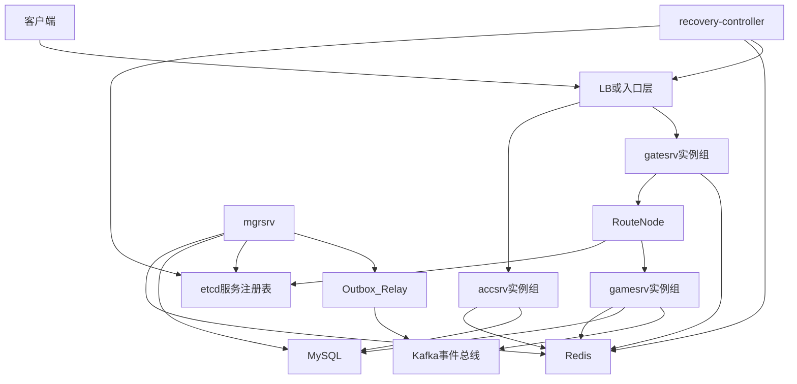
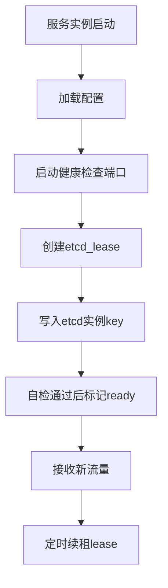
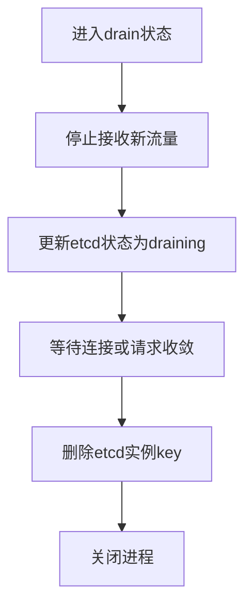
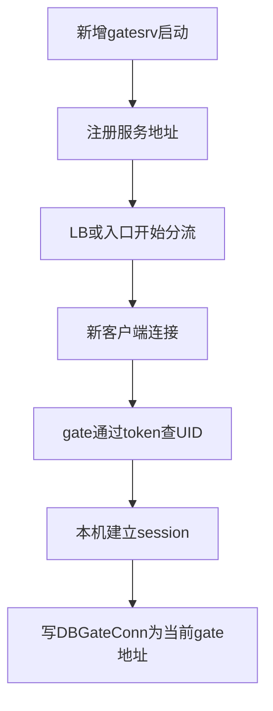

# 部署方案

> 文档定位：说明各服务如何部署、注册、发现、扩缩容和恢复。服务职责见 `server-architecture.md`，运行时链路见 `runtime-flows.md`。

## 快速摘要

| 主题 | 策略 |
| --- | --- |
| 服务发现 | etcd 注册实例、lease 续租、ready/draining/offline 状态管理 |
| 接入层 | `accsrv` 走 HTTP LB，`gatesrv` 承接 WebSocket 长连接 |
| 请求保护 | `gamesrv` 使用本机请求队列做削峰、背压和超时 |
| 事件总线 | Kafka 只做事件通知，不替代 MySQL 权威数据 |
| 容灾 | readiness 摘流、Redis TTL、客户端重连、`recovery-controller` 增强治理 |
| 扩缩容 | gate 按连接数扩缩，game 按 CPU/业务请求量扩缩 |

## 1. 部署目标

部署方案需要保证 `accsrv`、`gatesrv`、`gamesrv` 可以独立扩缩容，并在单个实例故障时通过健康检查、服务发现、TTL 和客户端重连恢复服务。

本文关注部署和运维策略。服务职责和请求链路见 `server-architecture.md`，全局邮件业务设计见 `requirements-design.md`。

## 2. 环境假设

基础依赖：

| 组件 | 职责 |
| --- | --- |
| LB/入口层 | 承接客户端登录和 WebSocket 连接 |
| etcd | 服务注册、服务发现、租约和实例健康状态 |
| Redis | token、连接位置、路由、全局邮件缓存和版本 |
| MySQL | 账号、邮件、玩家状态等权威数据 |
| Kafka | 业务事件总线，承接全局邮件、活动、公告、配置变更等事件通知 |
| Outbox Relay | 从 MySQL outbox 表投递业务事件到 Kafka |
| recovery-controller | 自动化故障摘除、路由清理和告警联动 |
| 日志/监控 | 采集服务日志、指标和告警 |

部署单元：

```text
accsrv  : 多实例，无状态或弱状态
gatesrv : 多实例，维护本机 WebSocket 长连接
gamesrv : 多实例，处理玩家业务逻辑
mgrsrv  : 内部管理服务，按访问控制部署
```

## 3. 部署拓扑



推荐策略：

- `accsrv` 按登录请求量水平扩容。
- `gatesrv` 按在线连接数和网络吞吐水平扩容。
- `gamesrv` 按业务请求量、CPU 和内存水平扩容。
- etcd、Redis、MySQL、Kafka 使用高可用部署，避免成为单点。

## 4. etcd 服务发现方案

服务注册和发现统一使用 etcd。每个服务实例启动后写入自己的实例信息，并绑定 etcd lease；实例持续 heartbeat 续租，进程异常或网络隔离导致 lease 过期后，实例 key 自动删除。

服务发现需要管理两类地址：

```text
gatesrv:
    PublicAddr / GatewayAddr
    用于 LB 分流和其他服务推送到玩家当前 gate

gamesrv:
    FrpcAddr
    GrpcAddr
    用于 gatesrv 路由玩家业务请求
```

推荐 key 设计：

```text
/rh/services/{service_name}/{instance_id}

value:
    service_name
    instance_id
    public_addr
    grpc_addr
    frpc_addr
    status: starting/ready/draining/offline
    weight
    zone
    version
    start_time
    update_time
```

etcd 管理规则：

- 每个实例注册 key 必须绑定 lease。
- `ready` 实例才允许被新路由选中。
- `draining` 实例保留在 etcd 中，但 `RouteNode` 不再分配新玩家。
- lease 过期或 key 删除后，watch 客户端要立即更新本地服务列表。
- 服务列表变化时，`gatesrv` 本地缓存通过 etcd watch 增量更新，watch 异常后全量拉取兜底。

实例启动流程：



实例下线流程：



业务代码只依赖服务发现接口，不直接散落 etcd 调用。推荐封装：

```text
Register(instance)
KeepAlive(instanceID)
UpdateStatus(instanceID, status)
Unregister(instanceID)
Watch(serviceName)
ListReady(serviceName)
```

## 5. LB 和接入层

`accsrv`：

- 走 HTTP 负载均衡，客户端通过 `POST /login` 登录，请求和回包使用 `login.proto` 的 `LoginRequest/LoginResponse`。
- 实例无状态，任意健康实例都可以处理登录。
- 登录时转发 `gamesrv.GameService.Login` 完成用户注册/资料初始化，成功后写 `DBLoginToken`，返回 `SessionKey`。

`gatesrv`：

- 承接 WebSocket 长连接。
- 新连接由 LB 分配到健康 `gatesrv`。
- 连接建立后不做连接迁移，故障时依赖客户端重连。
- LB 必须支持长连接超时配置，避免过早断开。
- 进程内使用 `ConnectionPool` 管理真实连接和 session 元数据，支持按 UID、ConnID 查询。
- 心跳只刷新本机连接池状态，Redis `DBGateConn` 按 `gate.gate_conn_renew_interval` 节流续期。
- 实例 drain 时 readiness 先置为 false，停止接收新连接，再等待已有连接自然下线或主动 `CloseAll`。

入口层要求：

- 只向 readiness 通过的实例转发新流量。
- 支持实例摘除后的连接 drain。
- 记录客户端 IP 或通过 header 透传，便于写入 `DBGateConn`。

推荐连接参数：

```text
gate.session_ttl: 90s
gate.gate_conn_renew_interval: 30s
client.heartbeat_interval: 10s
lb.idle_timeout: 大于 session_ttl，建议 120s 以上
```

## 6. Kafka 事件总线

Kafka 用于业务事件通知和未来扩展，不作为权威存储。全局邮件、活动、公告、配置变更等事件都可以复用统一事件总线。

推荐 topic：

```text
rh.global-mail-events      : 全局邮件变更事件
rh.activity-events         : 活动配置变更事件，预留
rh.announcement-events     : 公告变更事件，预留
rh.system-config-events    : 系统配置变更事件，预留
```

全局邮件事件投递链路：

```text
gmsrv/mgrsrv:
    MySQL 事务写业务数据和 GlobalMailOutboxEvent

Outbox Relay:
    扫描 pending outbox
    投递 Kafka
    成功后标记 published
    失败后保留 pending 并按退避策略重试

gamesrv:
    消费 Kafka 事件
    按 version 判断是否需要刷新本地缓存
    从 Redis/MySQL 加载最新数据
```

消费模型：

- 每台 `gamesrv` 都需要收到全局邮件变更事件。
- Kafka 中每台 `gamesrv` 建议使用独立 consumer group，确保事件广播到所有实例。
- 如果使用同一个 consumer group，事件会被分摊消费，不适合刷新每台 `gamesrv` 本地缓存。

可靠性要求：

- 事件 payload 只放 ID、version、action 等小字段，不放完整邮件内容。
- 消费端必须按 version 幂等处理重复和乱序事件。
- Kafka 延迟或故障时，Outbox Relay 重试，`gamesrv` 定时检查 `GlobalMailVersion` 兜底。
- Kafka 适合作为跨服务事件总线，但不能替代 MySQL 权威数据和 Redis 缓存版本。

## 7. gamesrv 请求队列

`gamesrv` 的请求队列用于同步玩家请求的本机削峰和背压，不承担跨进程可靠投递：

```text
gatesrv -> GameCommandService.Dispatch -> CommandRequestQueue -> worker pool -> CommandRegistry
```

部署建议：

- `game.request_queue_workers` 控制并发处理请求的 worker 数，建议接近实例可用 CPU 核心数或按业务耗时压测后调整。
- `game.request_queue_capacity` 控制单实例最大排队请求数，必须设置上限，避免内存被请求堆积打满。
- `game.request_timeout` 控制单请求从进入队列到处理完成的总耗时，超时返回 `CommandResponse(code=504)`。
- 队列满时返回 `CommandResponse(code=429)`，入口层或客户端需要按业务策略降频、提示繁忙或重试。
- 业务 handler 必须使用请求 `context` 调用 MySQL、Redis 和下游 RPC，否则超时只能释放外层 worker，不能强制杀死底层 goroutine。
- 这个队列不替代 Kafka；需要可靠异步投递、跨服务广播、失败重试的场景仍使用 Kafka + Outbox。

详细队列模型、返回码、监控指标和演进方向见 `request-queue-design.md`。

## 8. 健康检查

建议拆分为三类检查：

```text
liveness:
    进程是否存活，失败后可重启实例

readiness:
    实例是否可以接收新流量，失败后从 LB 或服务发现摘除

dependency:
    etcd、Redis、MySQL、Kafka、下游服务是否可用，用于告警和降级判断
```

各服务检查重点：

- `accsrv`：登录依赖、Redis/MySQL 写入能力、第三方登录依赖。
- `gatesrv`：WebSocket accept 能力、etcd/Redis 可用性、本机连接数是否超过水位。
- `gamesrv`：业务处理能力、etcd/Redis/MySQL/Kafka 可用性、内部 RPC 端口可访问。
- `mgrsrv`：内部鉴权、etcd/Redis/MySQL/Kafka 管理操作能力。
- `Outbox Relay`：MySQL outbox 读取能力、Kafka 投递能力、积压数量。

## 9. 扩缩容策略

新增 `gatesrv`：



新增 `gamesrv`：

- 实例启动并向 etcd 注册 `FrpcAddr`、`GrpcAddr`。
- `RouteNode` 或服务发现列表开始包含新节点。
- 已有玩家继续走原 `gamesrv`，不强制迁移。
- 新玩家或重建路由的玩家可能分配到新 `gamesrv`。

缩容 `gatesrv`：

- 先从 LB 摘除，停止接收新连接。
- 通知客户端或等待连接自然断开。
- 保留短时间 drain 窗口。
- 未清理的 `DBGateConn` 依赖 TTL 过期。

缩容 `gamesrv`：

- 先把 etcd 实例状态更新为 `draining`，避免新路由选中。
- 等待当前请求处理完成。
- 清理或停止续期相关 `DBSrvRouter`。
- 删除 etcd 实例 key 或停止 lease 续租。
- gate 发送失败后清路由并重新选择健康节点。

## 10. 故障恢复

`gatesrv` 故障：

```text
1. LB 健康检查失败，停止向故障 gate 分配新连接。
2. 客户端 WebSocket 断开或心跳超时。
3. 客户端重新连接入口层。
4. 新 gate 通过 token 查 DBLoginToken 恢复 UID。
5. 新 gate 覆盖写 DBGateConn。
6. 旧 DBGateConn 靠 TTL 清理。
```

`gamesrv` 故障：

```text
1. 健康检查失败或 etcd lease 过期后从服务发现摘除。
2. gate 发送请求失败或 CheckNodeTCPAddr 失败。
3. gate 清理 session 内存 route 和 DBSrvRouter。
4. gate 重新 RouteNode 选择健康 gamesrv。
5. 业务层通过幂等处理请求已执行但回包丢失的情况。
```

etcd 故障：

- 已经缓存的服务列表可以短时间继续使用。
- 新实例注册和服务列表变更会受影响，需要快速告警。
- `gatesrv` watch 断开后要重试，恢复后全量拉取服务列表。
- 不允许把未知或过期实例作为新路由目标。

Redis 故障：

- 登录和连接绑定可能受影响，需要快速告警。
- `gatesrv` 不应信任本地旧 token 创建新身份。
- 全局邮件读取可以使用 `gamesrv` 旧本地缓存提供只读降级。
- 恢复后依赖版本和 TTL 逐步收敛。

MySQL 故障：

- 账号创建、邮件发布、领取状态落库等写路径会受影响。
- 已在 Redis 和本地缓存中的只读数据可以按降级策略短时间服务。
- 奖励领取这类强一致写路径不能只靠缓存确认成功。

Kafka 故障：

- 全局邮件、活动、公告等事件通知会延迟。
- Outbox Relay 不删除 pending 事件，等待 Kafka 恢复后继续投递。
- `gamesrv` 通过定时检查 Redis `GlobalMailVersion` 兜底刷新本地缓存。
- Kafka 恢复后可能投递旧事件，消费端必须按 version 幂等忽略。

## 11. 自动化容灾方案

自动化容灾分为基础自动化和增强自动化两层。基础自动化由服务自身、etcd、LB、Redis TTL 完成；增强自动化由 `recovery-controller` 统一处理故障摘除、路由清理、广播刷新和告警联动。

### 11.1 基础自动化

```text
实例级:
    liveness 失败 -> 自动重启实例
    readiness 失败 -> 自动停止接收新流量
    etcd lease 过期 -> 自动删除实例 key
    LB 健康检查失败 -> 自动摘除实例

路由级:
    gatesrv watch etcd -> 自动更新健康 gamesrv 列表
    SendPktToAddr 失败 -> 自动清理 session route
    CheckNodeTCPAddr 失败 -> 自动清理 DBSrvRouter
    RouteNode 重选 -> 自动路由到健康 gamesrv

连接级:
    gatesrv 故障 -> 客户端心跳超时
    客户端自动重连 LB
    新 gatesrv 查 DBLoginToken 恢复 UID
    新 gatesrv 覆盖写 DBGateConn
```

### 11.2 recovery-controller

`recovery-controller` 不在玩家请求主链路上，只做旁路自动化治理。

输入信号：

```text
etcd:
    服务实例 key 变化
    lease 过期
    status 变为 unhealthy/draining/offline

metrics:
    SendPktToAddr 失败率
    RouteNode 失败率
    WebSocket 断连数
    Redis/MySQL/etcd 错误率

Redis:
    DBSrvRouter 失败计数
    DBGateConn 续期失败计数
```

自动化动作：

```text
gamesrv unhealthy:
    1. 更新 etcd 状态为 draining 或 offline
    2. 阻止 RouteNode 继续选择该实例
    3. 删除或标记关联的 DBSrvRouter
    4. 通知 gatesrv 刷新本地服务列表
    5. 触发告警并记录故障事件

gatesrv unhealthy:
    1. 从 LB 摘除该 gate
    2. 更新 etcd 状态为 offline
    3. 等待客户端自动重连
    4. 依赖 DBGateConn TTL 清理旧连接位置
    5. 触发告警并记录故障事件

etcd watch 异常:
    1. gatesrv 使用短时间本地快照继续服务
    2. 自动重建 watch
    3. 恢复后全量拉取 ready 实例列表
```

### 11.3 自动化边界

- 自动摘除只影响新流量，已经在处理中的请求依赖服务自身超时和幂等处理。
- `gatesrv` 连接不做迁移，依赖客户端重连恢复。
- `gamesrv` 自动重路由不能保证请求一定没有执行过，业务层必须支持幂等。
- Redis/MySQL 故障不自动跳过强一致写入，领取奖励等写路径必须返回失败或降级提示。

## 12. 配置项

建议每个服务实例具备以下配置：

```text
ServiceName
InstanceID
ListenAddr
PublicAddr
GrpcAddr
FrpcAddr
RegisterTTL
RegisterHeartbeatInterval
EtcdAddr
ReadinessAddr
LivenessAddr
RedisAddr
MySQLAddr
KafkaBrokers
KafkaTopicPrefix
OutboxRelayEnabled
OutboxRelayBatchSize
OutboxRelayRetryInterval
LogLevel
MaxConn
DrainTimeout
GameRequestQueueWorkers
GameRequestQueueCapacity
GameRequestTimeout
RecoveryControllerEnabled
RouteFailureThreshold
InstanceUnhealthyThreshold
```

配置原则：

- 地址和实例 ID 由部署系统注入，避免写死。
- 不同环境使用独立配置，避免测试环境误连正式环境。
- 密钥和数据库密码不进入文档和代码仓库。
- TTL、心跳间隔、drain 超时需要和 LB 超时配套。

## 13. 上线步骤

标准发布流程：

```text
1. 发布前检查 MySQL schema、Redis key、etcd 注册配置、Kafka topic 和 outbox 表兼容性。
2. 部署新版本实例，但 readiness 暂不放量。
3. 健康检查通过后写入 etcd 并逐步加入 LB 或服务发现。
4. 观察错误率、连接数、登录成功率和业务耗时。
5. 按批次替换旧实例。
6. 旧实例进入 drain，停止新流量。
7. 确认连接和请求收敛后关闭旧实例。
8. 保留回滚版本和配置。
```

回滚要求：

- 回滚版本可以识别现有 `DBLoginToken`、`DBGateConn`、`DBSrvRouter`。
- Redis key、MySQL 字段、etcd value 字段和 Kafka 事件 schema 变更要兼容至少一个发布周期。
- 先回滚无状态服务，再处理长连接 `gatesrv` 的 drain。

## 14. 监控和告警

关键指标：

- 登录成功率、登录耗时、第三方鉴权失败率。
- WebSocket 当前连接数、连接建立失败率、心跳超时数。
- `DBGateConn` 写入失败率和 TTL 续期失败率。
- `RouteNode` 成功率、`DBSrvRouter` 命中率、重路由次数。
- `gamesrv` 请求耗时、错误率、CPU、内存和 goroutine 数。
- etcd watch 断开次数、lease 续租失败率、服务列表变更延迟。
- recovery-controller 自动摘除次数、自动清理路由次数、动作失败率。
- Kafka 生产失败率、消费延迟、consumer lag、topic 积压。
- Outbox Relay pending 数量、投递失败率、最大滞留时间。
- Redis/MySQL 请求耗时、错误率和连接池使用率。

关键告警：

- 任一服务可用实例数低于安全水位。
- 登录成功率或 WebSocket 连接成功率异常下降。
- `gamesrv` 大量发送失败或重路由。
- etcd lease 续租失败或 watch 大面积断开。
- recovery-controller 动作失败或短时间重复摘除同类实例。
- Kafka 投递失败、consumer lag 持续升高或 outbox 长时间积压。
- Redis/MySQL 延迟升高或错误率升高。
- `gatesrv` 单实例连接数超过上限。
