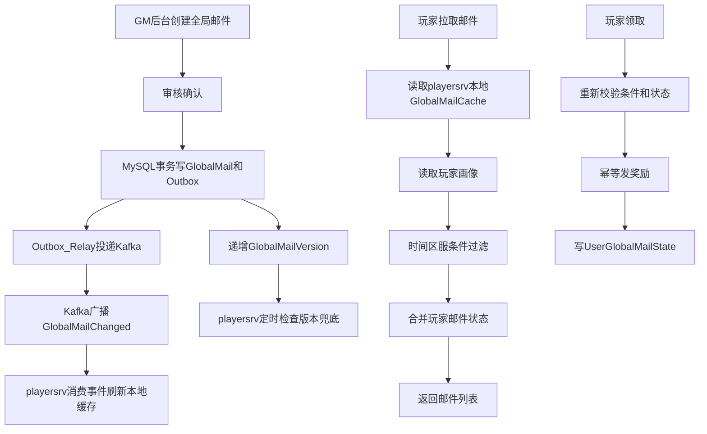
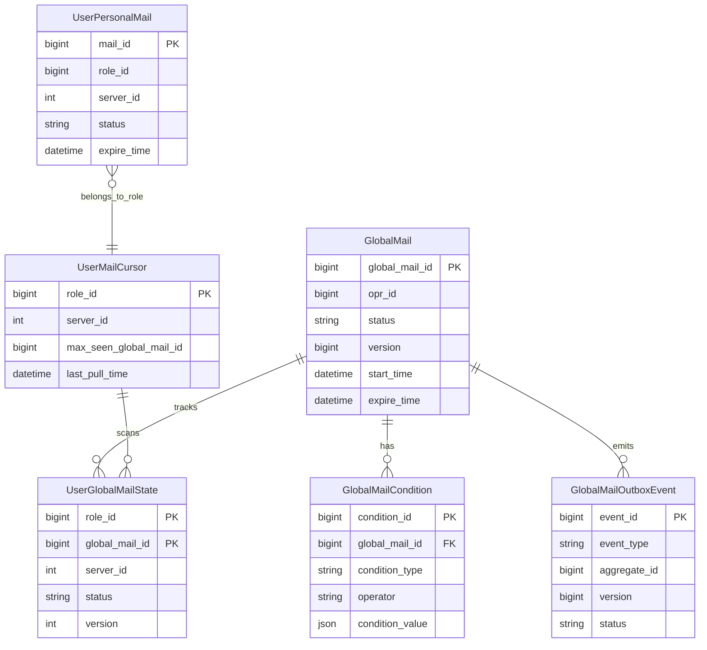
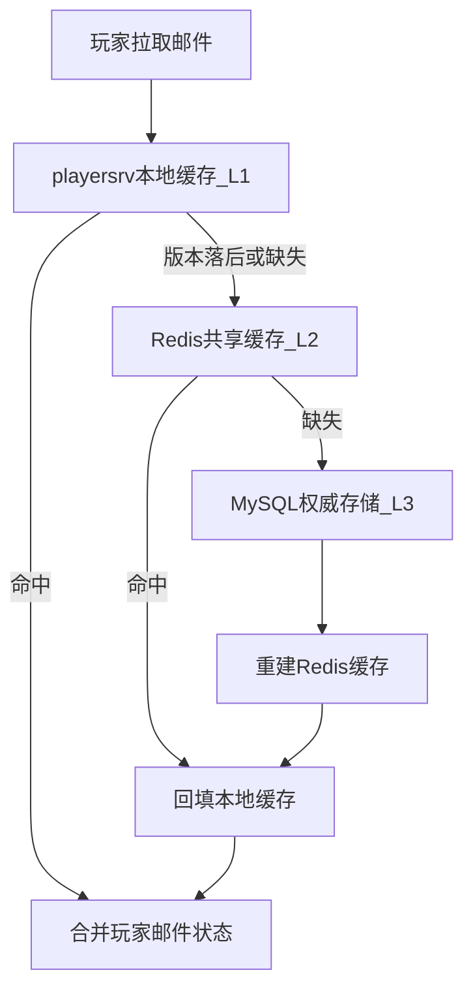
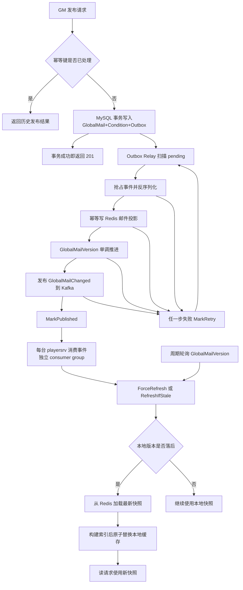
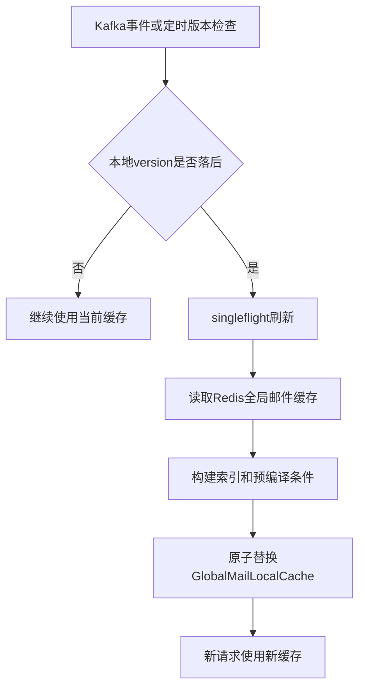
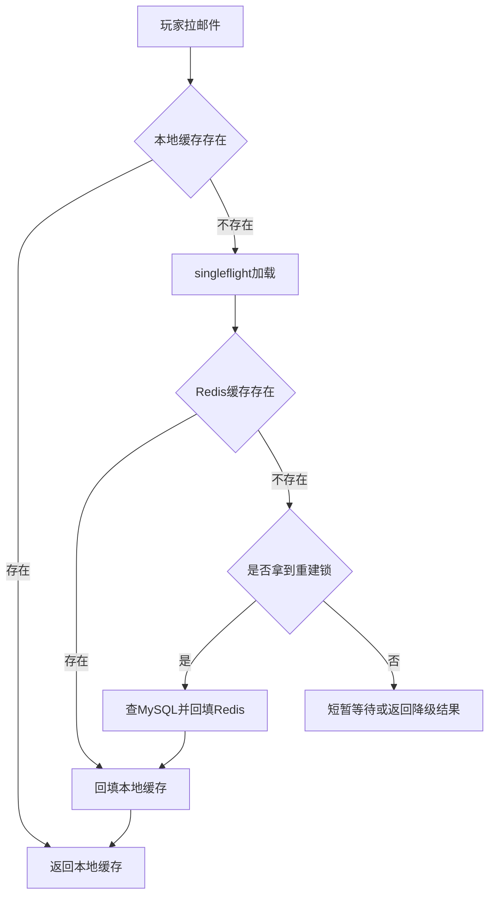

# 需求设计方案

> 文档定位：描述全局邮件业务本身，包括数据模型、缓存结构、事件通知、条件过滤、请求路径和风险点。服务架构见 `server-architecture.md`，运行时链路见 `runtime-flows.md`，数据一致性和幂等性基准见 `data-consistency-idempotency.md`。

## 快速摘要

| 主题 | 决策 |
| --- | --- |
| 写入模型 | 发布一封全局邮件，不按玩家逐个写个人邮件 |
| 读取模型 | 玩家拉取时动态合并全局邮件和个人状态 |
| 权威存储 | MySQL 保存邮件、条件、玩家状态和 outbox |
| 缓存 | `playersrv` 本地缓存 + Redis + MySQL 三级缓存 |
| 通知 | MySQL Outbox + Kafka 广播变更事件 |
| 幂等 | 发布、Outbox、缓存投影、消费、领取和请求重试都必须支持重复执行，详细规则见 `data-consistency-idempotency.md` |

## 1. 需求背景

全局邮件用于 GM 或系统向大量玩家发放通知和奖励。目标规模按 300 万玩家考虑，不能在发布时逐个写入 300 万封个人邮件，否则会造成写入峰值、存储膨胀和后续清理压力。

推荐方案：

| 阶段 | 做法 | 目的 |
| --- | --- | --- |
| 发布 | 只创建一封全局邮件 | 避免 300 万玩家逐个写邮件 |
| 读取 | 玩家拉取邮箱时动态合并全局邮件和个人状态 | 降低写放大，保持读取可扩展 |
| 状态变更 | 玩家领取或删除时才写个人状态 | 只为真实交互产生个人状态数据 |

## 2. 功能范围

全局邮件需要支持：

- GM 后台创建、审核、发布和下线全局邮件。
- 按时间、区服、注册时间、渠道、国家、VIP、累充、战队等级等条件筛选玩家。
- 玩家拉取邮箱时合并个人邮件和符合条件的全局邮件。
- 玩家读取、领取、删除全局邮件时只写个人状态。
- 奖励领取必须幂等，避免重复发奖。
- 邮件内容高频读取时走 `playersrv` 本地缓存 + Redis + MySQL 三级缓存，不直接打 MySQL。
- 使用 Kafka 作为业务事件总线，支持全局邮件发布通知，并为后续活动、公告、配置变更等事件扩展预留能力。

不在本方案展开的内容：

- 登录、长连接和路由架构，见 `server-architecture.md`。
- 部署、服务发现和运维策略，见 `deployment-plan.md`。

## 3. 基础流程



## 4. MySQL 数据模型

MySQL 是全局邮件和玩家邮件状态的权威存储，负责保存完整业务数据和最终一致的领取状态。

### 4.1 表关系图



### 4.2 表设计

#### GlobalMail

全局邮件主表，只存一份全局邮件内容、奖励配置、状态和生效时间。

```sql
CREATE TABLE global_mail (
    global_mail_id      BIGINT       NOT NULL COMMENT '全局邮件ID',
    opr_id              BIGINT       NOT NULL COMMENT '操作人或发布单号',
    title               VARCHAR(256) NOT NULL COMMENT '标题',
    content             TEXT         NOT NULL COMMENT '正文',
    msg_map             JSON         NULL     COMMENT '多语言内容',
    loots               JSON         NULL     COMMENT '奖励内容',
    sender              VARCHAR(64)  NOT NULL COMMENT '发件人',
    mail_category       VARCHAR(32)  NOT NULL COMMENT '邮件分类',
    mail_template_id    BIGINT       NOT NULL DEFAULT 0 COMMENT '模板ID',
    param_list          JSON         NULL     COMMENT '模板参数',
    external_url        VARCHAR(512) NULL     COMMENT '外链',
    start_time          DATETIME     NOT NULL COMMENT '生效时间',
    expire_time         DATETIME     NOT NULL COMMENT '过期时间',
    status              VARCHAR(32)  NOT NULL COMMENT 'draft/auditing/published/offline/deleted',
    version             BIGINT       NOT NULL DEFAULT 1 COMMENT '邮件版本',
    create_time         DATETIME     NOT NULL,
    update_time         DATETIME     NOT NULL,
    PRIMARY KEY (global_mail_id),
    KEY idx_status_time (status, start_time, expire_time),
    KEY idx_update_time (update_time)
) COMMENT='全局邮件主表';
```

设计要点：

```text
写入频率: 低，GM 发布或修改时写入
读取频率: 中，缓存重建和后台管理查询
缓存策略: 发布后写入 Redis GlobalMail:{globalMailId}
状态流转: draft -> auditing -> published -> offline/deleted
```

#### GlobalMailCondition

全局邮件条件表，用于描述邮件可见范围。一封邮件可以有多条条件。

```sql
CREATE TABLE global_mail_condition (
    condition_id       BIGINT      NOT NULL COMMENT '条件ID',
    global_mail_id     BIGINT      NOT NULL COMMENT '全局邮件ID',
    condition_type     VARCHAR(64) NOT NULL COMMENT 'server/register_time/channel/country/vip/recharge',
    operator           VARCHAR(16) NOT NULL COMMENT 'eq/ne/gt/gte/lt/lte/in/range',
    condition_value    JSON        NOT NULL COMMENT '条件值',
    create_time        DATETIME    NOT NULL,
    update_time        DATETIME    NOT NULL,
    PRIMARY KEY (condition_id),
    KEY idx_global_mail_id (global_mail_id),
    KEY idx_condition_type (condition_type)
) COMMENT='全局邮件条件表';
```

设计要点：

```text
常见条件:
    server_id、register_time、channel、country、vip_level、total_recharge、corps_level、open_days

读取路径:
    缓存重建时读取并编译为 playersrv 本地 CompiledCondition

约束:
    global_mail_id 必须对应存在的 GlobalMail
```

#### UserPersonalMail

玩家个人邮件表，只保存真正发给单个玩家的个人邮件。

```sql
CREATE TABLE user_personal_mail (
    mail_id          BIGINT       NOT NULL COMMENT '个人邮件ID',
    role_id          BIGINT       NOT NULL COMMENT '角色ID',
    server_id        INT          NOT NULL COMMENT '区服ID',
    title            VARCHAR(256) NOT NULL COMMENT '标题',
    content          TEXT         NOT NULL COMMENT '正文',
    template_id      BIGINT       NOT NULL DEFAULT 0 COMMENT '模板ID',
    param_list       JSON         NULL     COMMENT '模板参数',
    loots            JSON         NULL     COMMENT '奖励内容',
    status           VARCHAR(32)  NOT NULL COMMENT 'unread/read/claimed/deleted',
    create_time      DATETIME     NOT NULL,
    expire_time      DATETIME     NOT NULL,
    update_time      DATETIME     NOT NULL,
    PRIMARY KEY (mail_id),
    KEY idx_role_status_time (role_id, status, expire_time),
    KEY idx_role_create_time (role_id, create_time)
) COMMENT='玩家个人邮件表';
```

设计要点：

```text
分表建议:
    按 role_id hash 分表，或按 server_id + role_id 分库分表

写入时机:
    单人邮件、补偿邮件、系统点对点邮件

读取路径:
    玩家拉取邮件列表时按 role_id 查询
```

#### UserGlobalMailState

玩家全局邮件状态表，只记录玩家对某封全局邮件的个人状态，不重复保存全局邮件内容。

```sql
CREATE TABLE user_global_mail_state (
    role_id                BIGINT      NOT NULL COMMENT '角色ID',
    server_id              INT         NOT NULL COMMENT '区服ID',
    global_mail_id         BIGINT      NOT NULL COMMENT '全局邮件ID',
    status                 VARCHAR(32) NOT NULL COMMENT 'unread/read/claimed/deleted',
    claimed_loot_indexes   JSON        NULL     COMMENT '已领取奖励下标',
    claim_time             DATETIME    NULL,
    delete_time            DATETIME    NULL,
    version                INT         NOT NULL DEFAULT 1 COMMENT '状态版本',
    create_time            DATETIME    NOT NULL,
    update_time            DATETIME    NOT NULL,
    PRIMARY KEY (role_id, global_mail_id),
    KEY idx_role_status (role_id, status),
    KEY idx_global_mail_id (global_mail_id)
) COMMENT='玩家全局邮件状态表';
```

设计要点：

```text
分表建议:
    按 role_id hash 分表，避免 300 万玩家状态集中写入单表

写入时机:
    玩家读取、领取、删除全局邮件时写入

幂等约束:
    role_id + global_mail_id 唯一

并发控制:
    version 用于防并发覆盖，领取时必须重新校验状态
```

#### UserMailCursor

玩家邮件游标表，用于记录玩家已看过的全局邮件进度，减少重复扫描范围。

```sql
CREATE TABLE user_mail_cursor (
    role_id                    BIGINT   NOT NULL COMMENT '角色ID',
    server_id                  INT      NOT NULL COMMENT '区服ID',
    max_seen_global_mail_id    BIGINT   NOT NULL DEFAULT 0 COMMENT '已看过的最大全局邮件ID',
    last_pull_time             DATETIME NULL COMMENT '最近拉取邮件时间',
    update_time                DATETIME NOT NULL,
    PRIMARY KEY (role_id),
    KEY idx_server_update_time (server_id, update_time)
) COMMENT='玩家邮件游标表';
```

设计要点：

```text
用途:
    记录玩家邮件扫描进度，不表示邮件是否已领取

更新时机:
    玩家成功拉取邮件列表后更新

风险:
    游标只能作为优化，不能替代 UserGlobalMailState
```

#### GlobalMailOutboxEvent

事件 outbox 表，用于可靠投递 Kafka 事件。

```sql
CREATE TABLE global_mail_outbox_event (
    event_id           BIGINT      NOT NULL COMMENT '事件ID',
    event_type         VARCHAR(64) NOT NULL COMMENT 'GlobalMailChanged',
    aggregate_id       BIGINT      NOT NULL COMMENT 'global_mail_id',
    version            BIGINT      NOT NULL COMMENT '全局邮件版本',
    payload            JSON        NOT NULL COMMENT '事件小payload',
    status             VARCHAR(32) NOT NULL COMMENT 'pending/published/failed',
    retry_count        INT         NOT NULL DEFAULT 0,
    next_retry_time    DATETIME    NULL,
    published_time     DATETIME    NULL,
    create_time        DATETIME    NOT NULL,
    update_time        DATETIME    NOT NULL,
    PRIMARY KEY (event_id),
    KEY idx_status_retry (status, next_retry_time),
    KEY idx_aggregate_version (aggregate_id, version)
) COMMENT='全局邮件事件Outbox表';
```

设计要点：

```text
写入时机:
    发布、更新、下线、删除全局邮件时，和业务表同事务写入

投递方式:
    Outbox Relay 扫描 pending 事件并投递 Kafka

重试策略:
    投递失败增加 retry_count，并按 next_retry_time 退避重试

消费幂等:
    playersrv 按 version 判断是否需要刷新本地缓存
```

### 4.3 写入事务

发布全局邮件时，业务数据和 outbox 事件必须在同一个 MySQL 事务内提交：

```text
BEGIN;

INSERT INTO GlobalMail ...
INSERT INTO GlobalMailCondition ...
INSERT INTO GlobalMailOutboxEvent ...

COMMIT;
```

事务提交后，由 `Outbox Relay` 异步投递 Kafka。这样可以保证邮件发布成功时，一定存在一条可重试投递的事件。

### 4.4 数据设计原则

- `GlobalMail` 只存一份邮件内容和奖励配置。
- `UserGlobalMailState` 只存玩家对某封全局邮件的个人状态。
- 已领取、已删除、部分领取等行为必须落个人状态。
- 全局邮件过期后可由后台任务清理索引，个人状态按保留周期归档或删除。
- `GlobalMailOutboxEvent` 和全局邮件发布在同一个 MySQL 事务内写入，避免“邮件发布成功但事件丢失”。

## 5. 三级缓存设计

全局邮件读取采用三级缓存：



```text
L1 playersrv 本地缓存:
    GlobalMailLocalCache
    承接玩家拉取邮件的高频读请求

L2 Redis:
    GlobalMailVersion
    GlobalMailIndex
    GlobalMail:{globalMailId}
    GlobalMailByServer:{serverID}
    MailUserProfile:{RoleID}
    承接跨 playersrv 共享缓存、版本号和热点索引

L3 MySQL:
    GlobalMail
    GlobalMailCondition
    UserPersonalMail
    UserGlobalMailState
    权威数据源和写入落点
```

读取原则：

- 玩家拉取邮件优先读 `playersrv` 本地缓存。
- 本地缓存缺失或版本落后时读 Redis 回填。
- Redis 缺失时通过 singleflight 和重建锁读取 MySQL，并回填 Redis 和本地缓存。
- 玩家领取奖励必须重新校验 MySQL 或权威业务数据，不能只信缓存。

## 6. Redis 缓存

Redis 是跨 `playersrv` 共享的二级缓存，负责保存版本号、活跃邮件索引、邮件详情和玩家画像短缓存。Redis 不是权威存储，缺失时可以回源 MySQL 重建。

### 6.1 Key 设计

```text
GlobalMailVersion
    type: string/integer
    value: 当前全局邮件版本
    ttl: 不过期
    用途: playersrv 判断本地缓存是否落后

GlobalMailIndex
    type: sorted set
    key: global_mail_id
    score: start_time 或 global_mail_id
    ttl: 不过期，后台任务清理过期邮件
    用途: 全局邮件基础索引

GlobalMailActiveIndex
    type: sorted set
    key: global_mail_id
    score: expire_time
    ttl: 不过期，按 expire_time 清理
    用途: 快速获取当前可能有效的邮件

GlobalMailByServer:{serverID}
    type: set/sorted set
    value: global_mail_id
    ttl: 不过期，随 GlobalMailVersion 重建
    用途: 按区服做第一层粗过滤

GlobalMail:{globalMailId}
    type: string/json 或 hash
    value: 邮件详情、奖励、时间、状态、条件摘要
    ttl: 到 expire_time 后延迟清理
    用途: playersrv 回填本地缓存

MailUserProfile:{RoleID}
    type: string/json 或 hash
    value: serverID、registerTime、vipLevel、totalRecharge 等
    ttl: 短 TTL，例如 60 到 300 秒
    用途: 条件检查时减少玩家画像读取压力

VisibleGlobalMailIds:{RoleID}:{GlobalMailVersion}
    type: list/set，可选
    value: 当前版本下玩家可见 global_mail_id
    ttl: 短 TTL，例如 60 到 300 秒
    用途: 大量复杂条件时缓存玩家可见结果
```

### 6.2 数据结构示例

`GlobalMail:{globalMailId}` 建议保存完整但紧凑的邮件缓存：

```text
{
    "global_mail_id": 1001,
    "version": 28,
    "status": "published",
    "title": "...",
    "content": "...",
    "loots": [...],
    "start_time": 1710000000,
    "expire_time": 1710600000,
    "server_ids": [1, 2, 3],
    "conditions": [...],
    "updated_at": 1710000000
}
```

`MailUserProfile:{RoleID}` 只放条件判断需要的字段：

```text
{
    "role_id": 90001,
    "uid": 10001,
    "server_id": 1,
    "register_time": 1710000000,
    "vip_level": 5,
    "total_recharge": 1000,
    "corps_level": 8,
    "open_days": 30,
    "package_type": "ios",
    "country": "CN"
}
```

### 6.3 Redis 职责

- 保存全局邮件版本号，驱动 `playersrv` 本地缓存刷新。
- 保存活跃邮件索引，减少 MySQL 扫描。
- 保存按区服聚合的邮件 ID，加速粗过滤。
- 缓存玩家画像，降低动态条件检查时的读取压力。
- 作为本地缓存重建的数据来源，避免所有 `playersrv` 同时回源 MySQL。

### 6.4 Redis 更新策略

```text
发布或更新全局邮件:
    1. MySQL 事务提交 GlobalMail 和 Outbox。
    2. 更新 GlobalMail:{globalMailId}。
    3. 更新 GlobalMailIndex、GlobalMailActiveIndex、GlobalMailByServer:{serverID}。
    4. INCR GlobalMailVersion。
    5. 通过 Kafka 通知 playersrv 刷新。

邮件过期或下线:
    1. 更新 GlobalMail 状态。
    2. 从活跃索引移除或标记不可见。
    3. 递增 GlobalMailVersion。
    4. 后台延迟清理详情 key 和索引。
```

### 6.5 Redis 风险控制

- 所有重建路径使用 singleflight，避免同一 `playersrv` 内重复回源。
- Redis 缺失时使用重建锁，避免多台 `playersrv` 同时打 MySQL。
- key TTL 增加随机抖动，避免同一时间大量过期。
- `GlobalMailVersion` 不设置短 TTL，避免版本丢失导致本地缓存无法判断新旧。
- Redis 不作为领取状态权威来源，领取和发奖仍以 MySQL 或业务权威数据为准。

## 7. Kafka 事件通知

Kafka 用作业务事件总线，只负责通知“版本发生变化”，不存放全局邮件完整内容，也不是权威状态。

全局邮件发布、Outbox Relay、Redis 投影、Kafka 消费、本地缓存刷新和玩家领取的完整一致性与幂等规则统一维护在 `data-consistency-idempotency.md`。本节只保留业务事件结构和读写链路摘要，避免两份文档重复定义同一套状态机。

推荐 topic：

```text
topic: rh.global-mail-events

event:
    event_id
    event_type: GlobalMailChanged
    global_mail_id
    version
    action: publish/update/offline/delete
    timestamp
```

发布流程：

```text
1. gmsrv/adminsrv 审核并发布全局邮件。
2. MySQL 事务写 GlobalMail、GlobalMailCondition、GlobalMailOutboxEvent。
3. MySQL 事务提交成功即返回发布成功（不等待 Redis 或 Kafka）。
4. Outbox Relay 扫描 pending 事件并抢占处理。
5. Outbox Relay 幂等更新 Redis 投影并推进 GlobalMailVersion。
6. Outbox Relay 投递 Kafka GlobalMailChanged。
7. Redis + Kafka 都成功后，Outbox Relay 标记事件为 published；失败则回退 pending 并重试。
```

消费流程：

```text
1. 每台 playersrv 消费 rh.global-mail-events。
2. 比较 event.version 和本地 GlobalMailLocalCache.version。
3. 如果本地版本落后，从 Redis 加载最新全局邮件缓存。
4. Redis 缺失时受控回源 MySQL。
5. 刷新 playersrv 本地 GlobalMailLocalCache。
6. 每台 playersrv 使用独立 consumer group（推荐带 instance_id）。
7. 定时轮询 Redis GlobalMailVersion 作为兜底。
```

广播消费要求：

- 每台 `playersrv` 都必须收到同一条 `GlobalMailChanged` 事件。
- Kafka 中可以让每台 `playersrv` 使用独立 consumer group，或者按稳定实例 ID 维护独立订阅语义。
- 同一 consumer group 会分摊消息，不适合“每台 playersrv 都刷新本地缓存”的场景。

可靠性要求：

- Kafka 事件只做加速通知，`GlobalMailVersion` 才是刷新依据。
- 事件可能重复，`playersrv` 必须按 `version` 幂等处理。
- 事件可能乱序，低于或等于本地版本的事件直接忽略。
- Kafka 短暂不可用时，Outbox Relay 保留 pending 事件并重试。
- 即使 Kafka 通知延迟，`playersrv` 定时轮询 `GlobalMailVersion` 也能最终刷新。

### 7.1 端到端一致性流程图（改造后）



## 8. playersrv 本地缓存

每台 `playersrv` 维护进程内本地缓存，承接玩家拉取邮件的高频读请求。本地缓存是 L1 缓存，特点是读取最快，但只在当前进程内有效。

### 8.1 缓存结构

```text
GlobalMailLocalCache
version:
    当前缓存对应的 GlobalMailVersion

max_global_mail_id:
    当前缓存中最大的 global_mail_id

mails_by_id:
    map[global_mail_id]GlobalMailCacheItem
    用于按 ID 获取邮件详情

active_mail_ids:
    []global_mail_id
    当前时间可能有效的邮件 ID 列表

mail_ids_by_server:
    map[server_id][]global_mail_id
    按区服预聚合，减少请求时扫描范围

compiled_conditions:
    map[global_mail_id]CompiledCondition
    预编译条件表达式，减少每次请求解析成本

last_refresh_time:
    最近一次刷新时间
```

`GlobalMailCacheItem` 建议结构：

```text
GlobalMailCacheItem
- global_mail_id
- version
- title/content/msg_map
- loots
- sender
- start_time
- expire_time
- status
- server_scope
- condition_summary
- raw_condition_ids
```

`CompiledCondition` 建议结构：

```text
CompiledCondition
- time_range
- server_matcher
- register_time_matcher
- static_profile_matchers
- dynamic_profile_matchers
```

### 8.2 刷新流程



刷新要求：

- `playersrv` 启动时预热。
- 本地缓存不硬过期，刷新失败时旧值可继续服务。
- 版本变化后台刷新。
- 使用 singleflight 防止并发击穿。
- Redis 作为二级缓存，MySQL 只作为权威存储。
- GM 发布后通过 Kafka 主动通知 `playersrv` 刷新，定时检查 `GlobalMailVersion` 兜底。

### 8.3 请求使用流程

```text
1. 读取当前 GlobalMailLocalCache 快照。
2. 按 server_id 从 mail_ids_by_server 获取候选邮件。
3. 按 start_time/expire_time/status 做基础过滤。
4. 加载 MailUserProfile。
5. 使用 compiled_conditions 做条件判断。
6. 查询 UserGlobalMailState 合并玩家状态。
7. 返回个人邮件 + 可见全局邮件。
```

### 8.4 本地缓存风险控制

- 缓存刷新采用构建新对象后原子替换，避免请求读到半成品。
- 刷新失败不清空旧缓存，避免 Redis/MySQL 抖动影响读路径。
- 后台刷新增加随机抖动，避免所有 `playersrv` 同时刷新。
- 本地缓存只服务读取列表，领取奖励必须重新校验权威数据。

## 9. 缓存击穿和雪崩处理

不能设计成：

```text
本地缓存miss -> 直接查MySQL
```

应该设计成：



关键策略：

- 启动预热。
- 本地缓存常驻。
- 旧缓存可用，后台刷新。
- singleflight。
- Redis 二级缓存。
- Redis 重建锁。
- MySQL 权威存储。
- 版本号驱动刷新。
- 刷新加随机抖动。

## 10. 条件检查设计

全局邮件内容可以缓存，但“玩家是否符合条件”需要分层处理。

条件分类：

```text
邮件自身条件:
    startTime/endTime
    srvIDList/srvIDRanges

玩家静态条件:
    注册时间
    所属区服
    渠道
    国家

玩家动态条件:
    VIP等级
    累充金额
    战队等级
    开服天数
    活跃状态
```

处理方式：

```text
1. 全局缓存中预编译条件和区服索引。
2. 请求时先按时间、区服、注册时间做粗过滤。
3. 一次性加载玩家画像 MailUserProfile。
4. 对候选邮件做动态条件检查。
5. 返回列表时可以使用短 TTL 玩家画像缓存。
6. 领取奖励时必须重新读取关键数据并二次校验。
```

玩家画像：

```text
MailUserProfile
- roleID
- uid
- serverID
- registerTime
- vipLevel
- totalRecharge
- corpsLevel
- openDays
- packageType
- country
```

领取时必须校验：

```text
邮件存在
邮件未过期
玩家未领取
玩家区服符合
玩家注册时间符合
动态条件符合
RoleID + GlobalMailId 幂等
```

## 11. 请求路径

玩家拉取邮件：

```text
1. 从 playersrv 本地 GlobalMailLocalCache 获取活跃全局邮件。
2. 按时间和区服做粗过滤。
3. 读取玩家画像 MailUserProfile。
4. 检查动态条件。
5. 查询 UserGlobalMailState 合并已读、已领、已删状态。
6. 合并 UserPersonalMail 后返回。
```

玩家领取全局邮件：

```text
1. 读取 GlobalMail 并确认仍然有效。
2. 重新读取关键玩家数据做二次条件校验。
3. 检查 UserGlobalMailState 是否已领取。
4. 使用 RoleID + GlobalMailId 做幂等发奖。
5. 写入或更新 UserGlobalMailState。
6. 返回领取结果。
```

## 12. 风险和测试点

需要重点验证：

- 发布一封全局邮件不会产生大量个人邮件写入。
- 300 万玩家拉取邮件时，热点路径主要命中 `playersrv` 本地缓存和 Redis。
- GM 发布后 Kafka 事件能触发各 `playersrv` 刷新。
- Kafka 延迟或短暂不可用时，Outbox Relay 能重试，`GlobalMailVersion` 轮询能兜底刷新。
- Redis 短暂不可用时，旧本地缓存仍可提供只读服务。
- MySQL 短暂抖动时，高频读路径不会直接击穿到 MySQL。
- 同一玩家重复点击领取不会重复发奖。
- 邮件过期、条件变化、玩家状态更新后，列表和领取结果一致。

## 13. 推荐最终分层

```text
MySQL:
    GlobalMail
    GlobalMailCondition
    UserPersonalMail
    UserGlobalMailState

Redis:
    GlobalMailVersion
    GlobalMailIndex
    GlobalMail:{id}
    GlobalMailByServer:{serverID}
    MailUserProfile:{roleID}

Kafka:
    rh.global-mail-events
    GlobalMailChanged

playersrv内存:
    GlobalMailLocalCache
    compiledConditions
    serverID index

玩家请求路径:
    优先读 playersrv 本地缓存
    本地缺失读 Redis
    Redis 缺失再受控回源 MySQL

玩家领取路径:
    强校验
    幂等发奖
    写个人状态
```

核心原则：

```text
全局邮件内容集中存、分层缓存。
玩家侧只存状态，不重复存完整邮件内容。
playersrv 本地缓存抗读流量。
Redis 负责二级缓存和版本。
Kafka 负责业务事件通知和未来扩展。
MySQL 只做权威存储，不进入高频请求路径。
```
