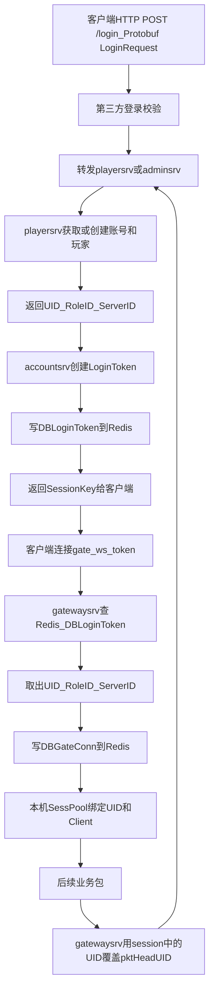
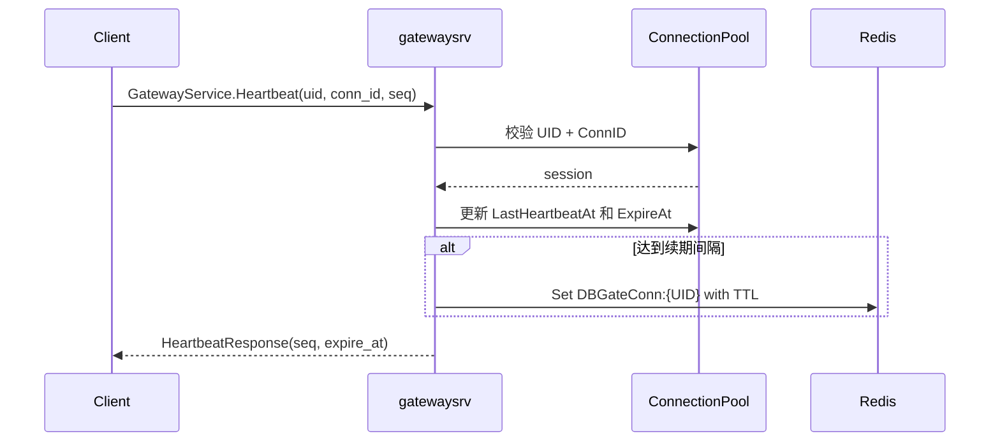
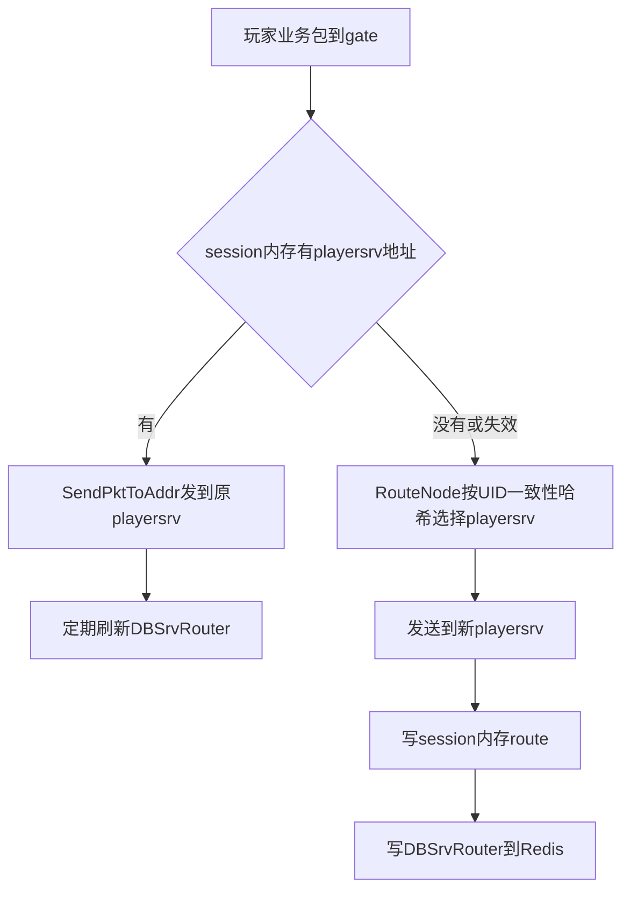
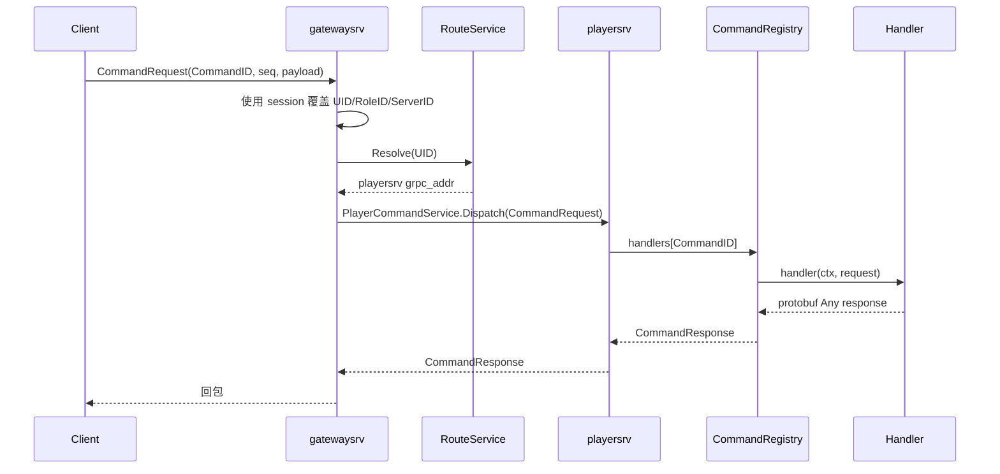
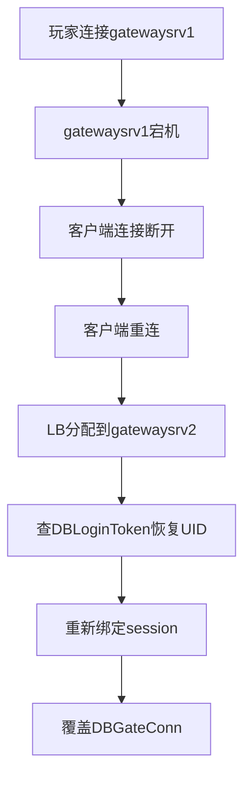
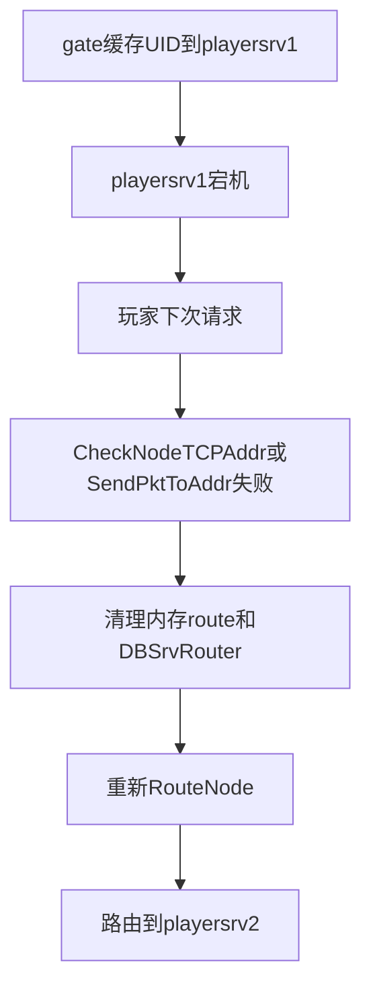
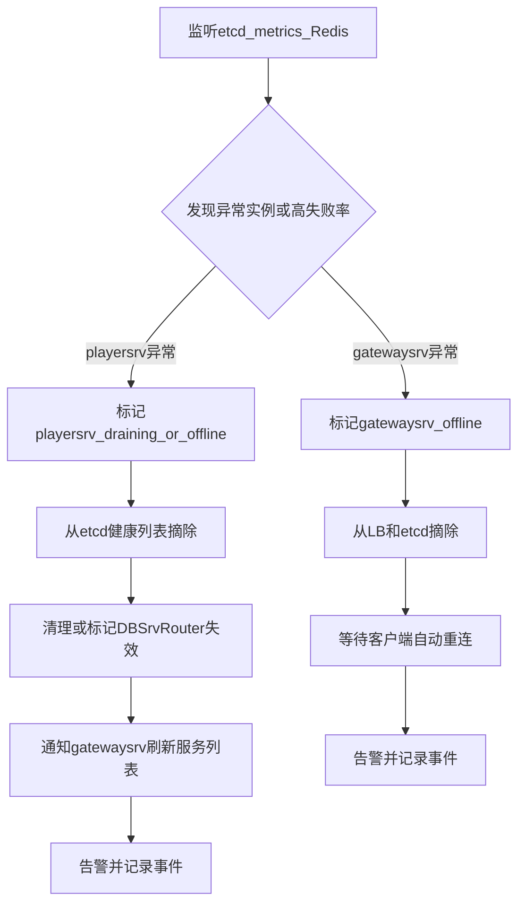

# 运行时流程设计

> 文档定位：用流程图和步骤说明请求在服务之间如何流转。架构边界见 `server-architecture.md`，部署和容灾见 `deployment-plan.md`。

## 快速摘要

| 流程 | 核心路径 |
| --- | --- |
| 登录 | Client HTTP `POST /login` -> `accountsrv` -> gRPC `playersrv.PlayerService.Login` -> Redis `DBLoginToken` |
| 连接 | Client WebSocket -> `gatewaysrv` -> Redis 校验 token -> `ConnectionPool` 和 `DBGateConn` |
| 心跳 | Client -> `GatewayService.Heartbeat` -> 刷新本机连接状态 -> 节流续期 Redis |
| 命令 | Client command -> `gatewaysrv` 路由 -> `playersrv` 按 `RoleID` 入队 -> `CommandRegistry` |
| 故障 | 失败清路由、客户端重连、Redis TTL 和 etcd lease 兜底 |

## 1. 目标

本文描述服务器运行时的关键流程，包括登录连接、多 gate 连接管理、`gatewaysrv` 到 `playersrv` 的路由，以及 gate/game 故障恢复。

架构分层和拆分原因见 `server-architecture.md`，etcd 注册发现和部署运维见 `deployment-plan.md`，请求队列详细设计见 `request-queue-design.md`。

## 2. 登录和连接流程



关键点：

- `accountsrv` 登录成功后创建 `DBLoginToken`，客户端拿到的是 `SessionKey`。
- 用户注册、玩家初始化和用户资料归属 `playersrv`；`accountsrv` 对外通过 HTTP 接收登录请求，对内通过 gRPC 转发登录请求到 `playersrv`。
- 登录请求和响应由 `api/rpc/login.proto` 的 `LoginRequest/LoginResponse` 定义；HTTP 层可使用 protojson 或 `application/x-protobuf` 二进制 protobuf。
- 客户端连接 `/gate/ws?token=xxx`。
- `gatewaysrv` 用 token 查 Redis 中的 `DBLoginToken`，拿到 `UID`、`RoleID`、`ServerID`。
- 后续客户端业务包中的 UID 不可信，gate 会用 session 中的 UID 覆盖包头。

## 3. 多 gatewaysrv 连接管理

玩家连接在哪台 gate，由 Redis 中的 `DBGateConn` 记录：

```text
DBGateConn:{UID}
- UID
- GatewayAddr
- ClientIP
- ConnID
- ConnTime
- LastActiveTime
- DeviceID
- ExpireAt
```

`DBGateConn` 的写入时机：

- 玩家通过 token 连接 `gatewaysrv` 并鉴权成功。
- 同一 UID 重连到新 `gatewaysrv` 时覆盖旧记录。
- 连接保持期间按心跳或续期任务刷新 TTL。

单台 `gatewaysrv` 的内存连接池负责快速找到和管理本机连接：

```text
ConnectionPool:
    key   : UID
    index : ConnID -> UID
    value : ClientConnection / Session / LastHeartbeatAt / ExpireAt / route cache
```

如果其他服务需要给玩家推送消息，先查 `DBGateConn` 获取玩家当前 gate 地址，再由目标 gate 从本机 `SessPool` 找连接下发。

连接可用性由三层保证：

```text
客户端:
    定时发送 HeartbeatRequest。
    超时未收到 HeartbeatResponse 时主动重连 LB。

gatewaysrv:
    ConnectionPool 保存真实连接对象和 UID、RoleID、ServerID、ConnID、LastHeartbeatAt、ExpireAt。
    每次心跳刷新本机 LastHeartbeatAt 和 ExpireAt。
    后台扫描过期 session，关闭真实连接并清理本机状态。

Redis:
    DBGateConn:{UID} 记录玩家当前 gate 位置。
    连接建立时写入。
    心跳不每次写 Redis，而是按 gateway_conn_renew_interval 节流续期。
    Redis TTL 兜底清理异常断开的连接位置。
```

心跳流程：



推荐默认值：

```text
heartbeat_interval: 10s
session_ttl: 90s
gateway_conn_renew_interval: 30s
```

## 4. gatewaysrv 到 playersrv 的路由

gate 转发玩家业务包时，会尽量把同一个 UID 固定到同一台 playersrv：



`RouteNode` 不直接写死 `playersrv` 地址，而是读取由 etcd watch 维护的本地健康实例列表，再按 UID 做一致性哈希选择目标节点。

一致性哈希规则：

```text
1. gatewaysrv watch etcd，维护 ready playersrv 实例列表。
2. 每个 playersrv 按 instance_id 生成多个虚拟节点。
3. UID 计算 hash 后在哈希环上顺时针找到第一个虚拟节点。
4. 命中的虚拟节点对应的真实 playersrv 即为目标节点。
5. playersrv 扩缩容时，只迁移落在相邻区间内的一部分 UID。
```

路由优先级：

```text
session route
    -> Redis DBSrvRouter:{UID}
    -> ConsistentHash(UID, healthyGamesrvList)
```

当前代码实现：

```text
cmd/gatewaysrv/main.go:
    组装 Redis route store、etcd playersrv provider、RouteService，注册 gatewaysrv 实例，并启动 gRPC GatewayService。

app/gatewaysrv/server.go:
    实现 GatewayService.ResolveRoute 和 GatewayService.ClearRoute，后续 WebSocket 协议层复用 RouteService。

app/gatewaysrv/session.go:
    维护 UID -> playersrv 的本机 session route cache。

app/gatewaysrv/router.go:
    使用一致性哈希按 UID 选择 playersrv。

app/gatewaysrv/route_service.go:
    串联 session route、Redis DBSrvRouter、etcd ready playersrv 列表和一致性哈希。

data/redis/routing.go:
    实现 DBLoginToken、DBGateConn、DBSrvRouter 的 Redis 读写、TTL 和删除。
```

## 5. 客户端命令转发流程

客户端业务包进入 `gatewaysrv` 后，`gatewaysrv` 不直接处理业务命令，只做命令解析、身份覆盖、路由和转发。



职责边界：

```text
gatewaysrv:
    解析 CommandID
    覆盖可信身份
    RouteService.Resolve(uid)
    转发到目标 playersrv Dispatch
    转发失败时 Clear(uid)

playersrv:
    CommandRegistry 注册 CommandID -> handler
    Dispatch 根据 CommandID 查找 handler
    handler 解析 protobuf Any 载荷
    调用具体业务服务
```

失败处理：

```text
1. gatewaysrv 调用目标 playersrv 失败。
2. gatewaysrv 调用 RouteService.Clear(uid)。
3. 清理本机 session route。
4. 删除 Redis DBSrvRouter:{UID}。
5. 后续请求重新 Resolve(uid)，选择健康 playersrv。
```

## 6. playersrv 全局邮件刷新流程

Kafka 消费链路：

```text
Kafka rh.global-mail-events
    -> infra/kafka.GlobalMailConsumer
    -> cmd/playersrv/main.go 组装消费者和 PlayerMailService
    -> app/playersrv.EventConsumer
    -> PlayerMailService.ForceRefreshCache
    -> domain/globalmail.LocalCache
```

邮件读取链路：

```text
客户端或 gatewaysrv gRPC PlayerMailService.ListGlobalMails
    -> api/rpc/mail.proto
    -> app/playersrv.MailRPCServer
    -> PlayerMailService.ListGlobalMails
    -> LocalCache.VisibleMails
    -> MailRepository.GetUserStates
    -> 合并 unread/read/claimed/deleted 状态
    -> 返回 protobuf GlobalMailItem 列表
```

邮件状态写入链路：

```text
PlayerMailService.MarkGlobalMailRead
PlayerMailService.ClaimGlobalMail
PlayerMailService.DeleteGlobalMail
    -> api/rpc/mail.proto
    -> app/playersrv.MailRPCServer
    -> PlayerMailService 重新校验可见性
    -> MailRepository.GetUserStates
    -> MailRepository.SaveUserState
    -> MySQL UserGlobalMailState
```

领取接口当前完成状态幂等合并，并通过 `playersrv` 内置背包服务发放奖励；奖励账本按 `role_id + global_mail_id + loot_index` 拦截重复发奖，背包发放明细按同一流水持久化。后续如果切到独立背包服务，应继续传入稳定奖励流水号，并记录外部服务返回状态用于补偿。

命令字分发链路：

```text
客户端业务包
    -> gatewaysrv 解析出 api/rpc/command.proto 中的 CommandID
    -> app/gatewaysrv.CommandForwarder
    -> RouteService.Resolve(uid) 找到目标 playersrv
    -> 调用目标 playersrv 的 PlayerCommandService.Dispatch
    -> PlayerCommandService.Dispatch
    -> CommandRequestQueue 全局容量检查
    -> 按 RoleID 进入玩家独立 lane
    -> worker pool 消费
    -> app/playersrv.CommandRegistry
    -> 按 CommandID 查找已注册 handler
    -> app/playersrv.mail_commands.go
    -> MailRPCServer 对应接口
```

如果 `gatewaysrv` 转发到目标 `playersrv` 失败，会调用 `RouteService.Clear(uid)` 清理本机 session route 和 Redis `DBSrvRouter:{UID}`，后续请求重新按 UID 选服。

`playersrv` 请求队列规则：

```text
正常:
    Dispatch 请求先占用全局容量。
    请求按 RoleID 进入对应玩家 lane。
    同一 RoleID 的请求 FIFO 串行处理。
    不同 RoleID 的 lane 可以并行处理。
    worker 从玩家 lane 取请求并调用 CommandRegistry。
    gRPC 请求等待 worker 返回 CommandResponse。

超时:
    game.request_timeout 从请求进入队列开始计时。
    包含排队等待和 handler 执行时间。
    超时后返回 CommandResponse(code=504, message="command request timeout")。
    handler 必须使用 context 调用数据库、Redis、下游 RPC，才能真正停止底层工作。

队列满:
    全局容量满或单个 RoleID lane 满时不再入队。
    立即返回 CommandResponse(code=429, message="command queue full")。

请求取消:
    客户端或上游 context 取消时，排队等待会尽快返回 context 错误。
```

RoleID lane 示例：

```text
RoleID=1001: A1 -> A2 -> A3   # 串行
RoleID=1002: B1 -> B2         # 串行
RoleID=1003: C1               # 串行

不同 RoleID 的 A1、B1、C1 可以在 worker 空闲时并行处理。
同一个 RoleID 的 A2 必须等待 A1 结束，避免同一玩家状态并发写入。
```

容量判定顺序：

```text
1. context 是否已取消
2. CommandRequestQueue 是否关闭
3. 全局 request_queue_capacity 是否有空位
4. 当前 RoleID 的 request_role_queue_capacity 是否有空位
5. 成功进入该玩家 lane
```

默认参数：

```text
game.request_queue_workers: 4
game.request_queue_capacity: 1024
game.request_role_queue_capacity: 32
game.request_timeout: 3s
```

更完整的队列模型、背压语义、超时要求和监控指标见 `request-queue-design.md`。

当前已注册命令：

```text
COMMAND_ID_MAIL_LIST_GLOBAL = 1001
COMMAND_ID_MAIL_MARK_READ   = 1002
COMMAND_ID_MAIL_CLAIM       = 1003
COMMAND_ID_MAIL_DELETE      = 1004
```

## 7. accountsrv 登录 Token 流程

当前代码骨架：

```text
客户端 HTTP POST /login
    -> api/rpc/login.proto LoginRequest/LoginResponse
    -> app/accountsrv.Server.Handler
    -> app/accountsrv.Service.Login
    -> gRPC PlayerService.Login
    -> app/playersrv.AccountService.GetOrCreateUser
    -> accountsrv 创建 LoginToken
    -> data/redis.SetLoginToken
    -> Redis DBLoginToken:{token}
```

`DBLoginToken` 保存 `uid`、`role_id`、`server_id` 和过期时间，后续 `gatewaysrv` 建立长连接时用于校验和绑定连接。`accountsrv` 不直接创建用户，只负责鉴权入口、转发 `playersrv`、生成短期登录 token。

`DBSrvRouter` 用于跨进程共享玩家后端路由：

```text
DBSrvRouter:{UID}
- UID
- List:
  - SrvName
  - FrpcAddr
  - GrpcAddr
```

内存 route 和 `DBSrvRouter` 的区别：

```text
session内存route:
    位置: 当前gatewaysrv进程内
    生命周期: 当前连接期间
    优点: 快
    缺点: gate挂了就丢，其他进程看不到

DBSrvRouter:
    位置: Redis
    生命周期: TTL，gate定期刷新
    优点: 跨gate和跨服务共享
    缺点: 比内存慢，需要清理和续期
```

路由变化策略：

- 已有玩家继续走原 `playersrv`，不因新增节点强制迁移。
- 新玩家或重建路由的玩家可以分配到新 `playersrv`。
- 原 `playersrv` 下线或发送失败时，gate 清理内存 route 和 `DBSrvRouter` 后重新 `RouteNode`。

## 8. gatewaysrv 容灾流程



gate 容灾依赖：

- `DBLoginToken` 恢复身份。
- `DBGateConn` 覆盖玩家当前 gate 位置。
- TTL 清理旧连接位置。
- 客户端重连机制。

自动化动作：

```text
1. liveness 或 LB 健康检查发现 gatewaysrv 异常。
2. LB 自动摘除异常 gatewaysrv，不再分配新连接。
3. etcd lease 过期后删除该 gatewaysrv 实例 key。
4. recovery-controller 记录故障事件并触发告警。
5. 客户端心跳超时后自动重连 LB。
6. 新 gatewaysrv 查 DBLoginToken 恢复身份，并覆盖写 DBGateConn。
7. 旧 DBGateConn 不需要强制同步清理，依赖 TTL 收敛。
```

## 9. playersrv 容灾流程



game 容灾依赖：

- 节点健康检查。
- 发送失败后重新路由。
- `DBSrvRouter` TTL。
- 业务层幂等，处理“请求已执行但回包丢失”的情况。

自动化动作：

```text
1. playersrv liveness/readiness 失败，或 etcd lease 过期。
2. etcd 删除实例 key，或者状态更新为 offline。
3. gatewaysrv 通过 etcd watch 更新本地健康 playersrv 列表。
4. gate 发送请求失败时，清理 session 内存 route。
5. gate 删除或覆盖 Redis 中的 DBSrvRouter。
6. gate 重新 RouteNode 选择健康 playersrv。
7. recovery-controller 可按失败计数批量标记旧路由失效，并触发告警。
```

## 10. recovery-controller 自动化流程

`recovery-controller` 是旁路控制器，不处理玩家请求，只监听状态并执行自动化治理动作。



自动化边界：

- controller 不直接迁移 WebSocket 连接，`gatewaysrv` 故障依赖客户端重连。
- controller 不绕过业务幂等，`playersrv` 故障后的重试仍要由业务层防重复执行。
- controller 不替代 Redis/MySQL 强一致写入，关键写路径失败时应返回失败或进入明确的降级流程。
