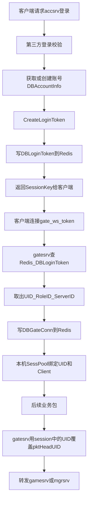
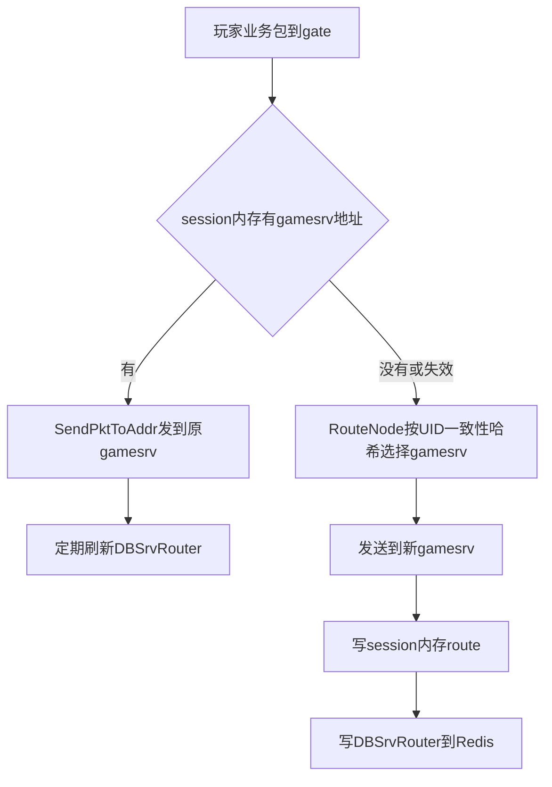
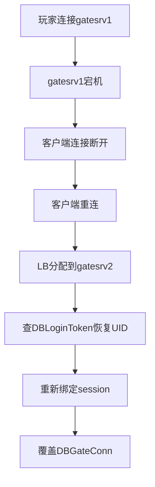
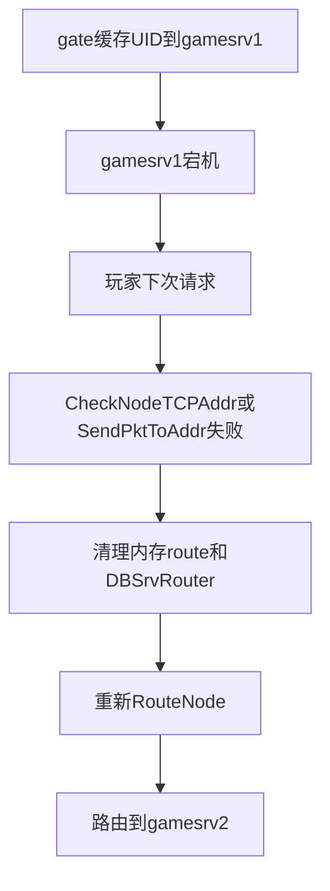
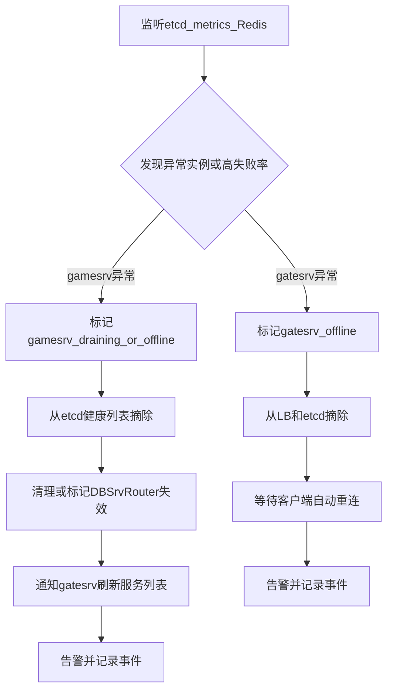

# 运行时流程设计

## 1. 目标

本文描述服务器运行时的关键流程，包括登录连接、多 gate 连接管理、`gatesrv` 到 `gamesrv` 的路由，以及 gate/game 故障恢复。

架构分层和拆分原因见 `server-architecture.md`，etcd 注册发现和部署运维见 `deployment-plan.md`。

## 2. 登录和连接流程



关键点：

- `accsrv` 登录成功后创建 `DBLoginToken`，客户端拿到的是 `SessionKey`。
- 客户端连接 `/gate/ws?token=xxx`。
- `gatesrv` 用 token 查 Redis 中的 `DBLoginToken`，拿到 `UID`、`RoleID`、`ServerID`。
- 后续客户端业务包中的 UID 不可信，gate 会用 session 中的 UID 覆盖包头。

## 3. 多 gatesrv 连接管理

玩家连接在哪台 gate，由 Redis 中的 `DBGateConn` 记录：

```text
DBGateConn:{UID}
- UID
- GatewayAddr
- ClientIP
- ConnID
- ConnTime
- DeviceID
```

`DBGateConn` 的写入时机：

- 玩家通过 token 连接 `gatesrv` 并鉴权成功。
- 同一 UID 重连到新 `gatesrv` 时覆盖旧记录。
- 连接保持期间按心跳或续期任务刷新 TTL。

单台 `gatesrv` 的内存 `SessPool` 只负责快速找到本机连接：

```text
SessPool:
    key   : UID
    value : Client session / ConnID / route cache
```

如果其他服务需要给玩家推送消息，先查 `DBGateConn` 获取玩家当前 gate 地址，再由目标 gate 从本机 `SessPool` 找连接下发。

## 4. gatesrv 到 gamesrv 的路由

gate 转发玩家业务包时，会尽量把同一个 UID 固定到同一台 gamesrv：



`RouteNode` 不直接写死 `gamesrv` 地址，而是读取由 etcd watch 维护的本地健康实例列表，再按 UID 做一致性哈希选择目标节点。

一致性哈希规则：

```text
1. gatesrv watch etcd，维护 ready gamesrv 实例列表。
2. 每个 gamesrv 按 instance_id 生成多个虚拟节点。
3. UID 计算 hash 后在哈希环上顺时针找到第一个虚拟节点。
4. 命中的虚拟节点对应的真实 gamesrv 即为目标节点。
5. gamesrv 扩缩容时，只迁移落在相邻区间内的一部分 UID。
```

路由优先级：

```text
session route
    -> Redis DBSrvRouter:{UID}
    -> ConsistentHash(UID, healthyGamesrvList)
```

`DBSrvRouter` 用于跨进程共享玩家后端路由：

```text
DBSrvRouter:{UID}
- UID
- List:
  - SrvName
  - FrpcAddr
  - GrpcAddr
```

内存 route 和 `DBSrvRouter` 的区别：

```text
session内存route:
    位置: 当前gatesrv进程内
    生命周期: 当前连接期间
    优点: 快
    缺点: gate挂了就丢，其他进程看不到

DBSrvRouter:
    位置: Redis
    生命周期: TTL，gate定期刷新
    优点: 跨gate和跨服务共享
    缺点: 比内存慢，需要清理和续期
```

路由变化策略：

- 已有玩家继续走原 `gamesrv`，不因新增节点强制迁移。
- 新玩家或重建路由的玩家可以分配到新 `gamesrv`。
- 原 `gamesrv` 下线或发送失败时，gate 清理内存 route 和 `DBSrvRouter` 后重新 `RouteNode`。

## 5. gatesrv 容灾流程



gate 容灾依赖：

- `DBLoginToken` 恢复身份。
- `DBGateConn` 覆盖玩家当前 gate 位置。
- TTL 清理旧连接位置。
- 客户端重连机制。

自动化动作：

```text
1. liveness 或 LB 健康检查发现 gatesrv 异常。
2. LB 自动摘除异常 gatesrv，不再分配新连接。
3. etcd lease 过期后删除该 gatesrv 实例 key。
4. recovery-controller 记录故障事件并触发告警。
5. 客户端心跳超时后自动重连 LB。
6. 新 gatesrv 查 DBLoginToken 恢复身份，并覆盖写 DBGateConn。
7. 旧 DBGateConn 不需要强制同步清理，依赖 TTL 收敛。
```

## 6. gamesrv 容灾流程



game 容灾依赖：

- 节点健康检查。
- 发送失败后重新路由。
- `DBSrvRouter` TTL。
- 业务层幂等，处理“请求已执行但回包丢失”的情况。

自动化动作：

```text
1. gamesrv liveness/readiness 失败，或 etcd lease 过期。
2. etcd 删除实例 key，或者状态更新为 offline。
3. gatesrv 通过 etcd watch 更新本地健康 gamesrv 列表。
4. gate 发送请求失败时，清理 session 内存 route。
5. gate 删除或覆盖 Redis 中的 DBSrvRouter。
6. gate 重新 RouteNode 选择健康 gamesrv。
7. recovery-controller 可按失败计数批量标记旧路由失效，并触发告警。
```

## 7. recovery-controller 自动化流程

`recovery-controller` 是旁路控制器，不处理玩家请求，只监听状态并执行自动化治理动作。



自动化边界：

- controller 不直接迁移 WebSocket 连接，`gatesrv` 故障依赖客户端重连。
- controller 不绕过业务幂等，`gamesrv` 故障后的重试仍要由业务层防重复执行。
- controller 不替代 Redis/MySQL 强一致写入，关键写路径失败时应返回失败或进入明确的降级流程。
