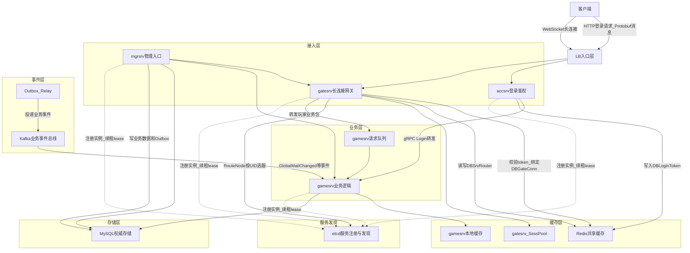

# 服务器架构方案

> 文档定位：说明服务为什么拆、怎么分层、各层之间如何协作。运行时细节见 `runtime-flows.md`，部署运维见 `deployment-plan.md`，请求队列细节见 `request-queue-design.md`。

## 快速摘要

| 主题 | 决策 |
| --- | --- |
| 服务拆分 | `accsrv`、`gatesrv`、`gamesrv`、`mgrsrv` 按压力模型和职责边界拆分 |
| 协议 | 外部登录使用 HTTP 承载 protobuf message，服务内部使用 gRPC + protobuf |
| 路由 | `gatesrv` 根据 UID 通过一致性哈希选择 `gamesrv` |
| 存储 | MySQL 做权威存储，Redis 做共享缓存和运行态索引，本地缓存承接热点读 |
| 事件 | MySQL Outbox + Kafka 负责跨实例业务事件通知 |
| 请求保护 | `gamesrv` 按 `RoleID` 建独立请求 lane，同玩家串行、不同玩家并行，并通过超时和背压保护同步请求链路 |

## 1. 目标

服务器架构按职责拆成登录鉴权、长连接接入、业务逻辑和管理入口四类服务，目标是让登录高峰、在线连接、业务请求和管理操作可以分别扩容、分别发布、分别容灾。

本文只描述架构分层、拆分原因、服务职责和数据归属。具体流程见 `runtime-flows.md`，部署、服务发现和运维方案见 `deployment-plan.md`，全局邮件业务设计见 `requirements-design.md`，请求队列细节见 `request-queue-design.md`。

## 2. 总体架构图



这张图表达四个核心关系：

- 登录链路：客户端经 LB 通过 HTTP 调用 `accsrv` 登录接口，请求和回包使用 `login.proto` 中的 protobuf message；`accsrv` 再通过 gRPC 转发到 `gamesrv` 处理用户注册/用户资料，随后写 `DBLoginToken` 到 Redis，并返回 `SessionKey`。
- 连接和路由链路：客户端经 LB 建立到 `gatesrv` 的 WebSocket，`gatesrv` 通过 Redis 恢复 UID，再通过 etcd 中的健康 `gamesrv` 列表做一致性哈希 `RouteNode`。
- 命令分发链路：`gatesrv` 从客户端业务包解析出 protobuf `CommandID`，按 UID 选择目标 `gamesrv`，再调用目标 `gamesrv` 的 `GameCommandService.Dispatch`；`gamesrv` 先按 `RoleID` 放入对应玩家 lane，再由 worker 调用命令注册表找到真正的业务 handler。
- 存储链路：运行态热点数据放本地内存和 Redis，账号、玩家、邮件、领取状态等权威数据落 MySQL。
- 服务发现链路：各服务启动后注册到 etcd，`gatesrv` 通过 etcd watch 得到健康 `gamesrv` 列表。
- 事件通知链路：管理入口写业务数据和 outbox，`Outbox Relay` 投递 Kafka，`gamesrv` 消费事件刷新本地缓存。

## 3. 整体设计思路

整体采用“接入层轻量转发，业务层集中处理”的思路。`accsrv`、`gatesrv` 都只处理连接、鉴权、身份恢复、路由和转发等接入问题，玩家注册、玩家资料、邮件读取、邮件领取等业务状态统一落到 `gamesrv`。

协议上统一使用 protobuf 定义 service、请求和回包，并生成 Go 代码。这样客户端、`gatesrv`、`gamesrv` 使用同一份协议契约，避免手写结构体和命令字分散在多个包里。当前协议边界如下：

```text
api/rpc/login.proto:
    LoginRequest/LoginResponse
    GameService.Login

api/rpc/gate.proto:
    GateService.ResolveRoute
    GateService.ClearRoute

api/rpc/command.proto:
    CommandID
    GameCommandService.Dispatch
    GameCommandService.ListCommands

api/rpc/mail.proto:
    MailService.ListGlobalMails
    MailService.MarkGlobalMailRead
    MailService.ClaimGlobalMail
    MailService.DeleteGlobalMail
```

命令字不再由业务代码手写常量，而是在 `command.proto` 里定义 `CommandID` 枚举。`gatesrv` 解析客户端业务包后只拿到 `CommandID`、可信 `UID/RoleID/ServerID` 和 protobuf `Any` 载荷，不直接执行业务规则。它先通过 `RouteService.Resolve(uid)` 找到目标 `gamesrv`，再转发到 `GameCommandService.Dispatch`。

`gamesrv` 启动时把 `CommandID` 注册到 `CommandRegistry`。注册项包含命令字、命令名、请求类型、回包类型和 handler。`Dispatch` 收到请求后按 `CommandID` 找到 handler，再由 handler 反序列化 `Any` 载荷并调用具体业务服务。例如全局邮件当前注册为：

```text
COMMAND_ID_MAIL_LIST_GLOBAL -> MailRPCServer.ListGlobalMails
COMMAND_ID_MAIL_MARK_READ   -> MailRPCServer.MarkGlobalMailRead
COMMAND_ID_MAIL_CLAIM       -> MailRPCServer.ClaimGlobalMail
COMMAND_ID_MAIL_DELETE      -> MailRPCServer.DeleteGlobalMail
```

路由失败或目标 `gamesrv` 调用失败时，`gatesrv` 会清理当前 UID 的本机 session route 和 Redis `DBSrvRouter:{UID}`，下一次请求重新根据 etcd ready gamesrv 列表和一致性哈希选择目标节点。

`gamesrv` 的请求队列属于进程内削峰和背压机制，不替代 Kafka。它只保护同步玩家请求链路：

```text
GameCommandService.Dispatch
    -> CommandRequestQueue 全局容量控制
    -> RoleID lane
    -> worker pool
    -> CommandRegistry.Dispatch
    -> 业务 handler
```

队列满时直接返回业务码 `429 command queue full`，让 `gatesrv` 或客户端可以快速失败、降频或重试，避免请求无限堆积。单请求还会受 `game.request_timeout` 约束，超时返回 `504 command request timeout`。详细设计见 `request-queue-design.md`。

## 4. 为什么拆分服务

### 4.1 按压力模型拆分

不同请求的压力模型不一样：

| 请求类型 | 压力特征 | 拆分目的 |
| --- | --- | --- |
| 登录请求 | 短连接、高峰集中、依赖第三方鉴权和账号数据 | 独立扩容登录入口，避免影响在线玩家 |
| 长连接 | 连接数大、持续时间长、网络 IO 和心跳压力明显 | 独立承接连接和心跳压力 |
| 业务请求 | 请求频率高、依赖玩家状态、需要按 UID 保持稳定路由 | 聚合玩家业务逻辑和状态访问 |
| 管理请求 | 低频但权限敏感，需要和玩家入口隔离 | 降低权限风险和故障半径 |

拆分后可以单独扩容。例如登录高峰只扩 `accsrv`，在线人数增长主要扩 `gatesrv`，业务 CPU 压力升高主要扩 `gamesrv`。

### 4.2 按职责边界拆分

拆分后每层只处理自己的问题：

- `accsrv` 只负责确认“这个玩家是谁”、转发登录请求和生成短期登录 token。
- `gatesrv` 只负责维护“这个玩家当前连在哪”。
- `gamesrv` 只负责处理“这个玩家的业务怎么执行”。
- `mgrsrv` 只负责内部管理操作，不混入玩家连接入口。

协议统一先用 protobuf 定义请求、回包、命令字和服务契约；服务内部交互使用 gRPC，`accsrv` 对客户端登录入口使用 HTTP 承载 protobuf `LoginRequest/LoginResponse`。当前登录链路定义在 `api/rpc/login.proto`，网关路由接口定义在 `api/rpc/gate.proto`，gamesrv 通用命令字和注册表定义在 `api/rpc/command.proto`，全局邮件读取和读/领/删状态接口定义在 `api/rpc/mail.proto`。

这样可以避免一个服务同时承担鉴权、连接、业务和管理逻辑，降低发布和排障复杂度。

### 4.3 按故障半径拆分

拆分服务后，单类故障不会直接拖垮所有能力：

- `accsrv` 异常主要影响新登录，不应该影响已在线连接。
- 单台 `gatesrv` 异常只影响连接在这台 gate 上的玩家，客户端重连后可恢复。
- 单台 `gamesrv` 异常只影响被路由到该节点的玩家请求，gate 可以清理路由后重新选服。
- `mgrsrv` 异常不应该影响玩家主链路。

## 5. 服务分层

```text
accsrv   : 登录鉴权，创建账号，签发 SessionKey/token
gatesrv  : 维护客户端长连接，绑定 UID，转发业务包
gamesrv  : 处理玩家业务逻辑
mgrsrv   : 管理后台或内部管理请求入口
```

### 5.1 accsrv 登录鉴权层

`accsrv` 的作用是把外部登录凭证转换成服务端可信身份。

负责：

- 对接第三方登录校验。
- 创建或读取账号信息。
- 生成 `SessionKey`。
- 写入 `DBLoginToken` 到 Redis。

不负责：

- 不维护 WebSocket 长连接。
- 不处理玩家业务逻辑。
- 不相信客户端自带 UID。

### 5.2 gatesrv 长连接接入层

`gatesrv` 的作用是承接客户端连接，并把客户端请求转成可信的服务端请求。

负责：

- 维护 WebSocket 长连接和心跳。
- 用 `SessionKey` 查询 `DBLoginToken`，恢复 `UID`、`RoleID`、`ServerID`。
- 维护本机 `ConnectionPool`，按 UID 和 ConnID 管理真实连接、session 元数据和过期时间。
- 写入和节流续期 `DBGateConn`，使用 Redis TTL 兜底清理异常连接位置。
- 根据 UID 路由到 `gamesrv`。
- 覆盖客户端包头中的 UID，防止伪造身份。

不负责：

- 不做第三方登录鉴权。
- 不保存玩家业务状态。
- 不直接决定业务规则。

### 5.3 gamesrv 业务逻辑层

`gamesrv` 的作用是处理玩家业务，承接真正的游戏逻辑和数据读写。

负责：

- 处理玩家业务协议。
- 读取和更新玩家业务数据。
- 维护业务热点本地缓存。
- 对领取奖励、状态变更等写操作做幂等处理。

不负责：

- 不直接承接客户端长连接。
- 不信任客户端身份，只信任 gate 转发后的服务端上下文。
- 不处理服务入口分流。

### 5.4 mgrsrv 管理入口层

`mgrsrv` 的作用是承接内部管理操作，让管理流量和玩家主链路隔离。

负责：

- GM 或后台管理请求。
- 内部运维、查询、通知类能力。
- 必要时通过 `DBGateConn` 找到玩家所在 `gatesrv`。

不负责：

- 不作为玩家长连接入口。
- 不绕过业务校验直接改玩家关键状态。

## 6. 核心数据归属

核心数据：

```text
DBLoginToken : token -> UID / RoleID / ServerID
DBGateConn   : UID -> 当前连接所在 gatesrv 地址
DBSrvRouter  : UID -> 当前路由到的 gamesrv 地址
SessPool     : 单台 gatesrv 内存中的 UID -> Client session
```

存储分层：

```text
本地内存 : gatesrv SessPool、gamesrv 业务热点缓存
Redis    : token、连接位置、玩家路由、全局邮件版本和热点索引
Kafka   : 全局邮件、活动、公告、配置变更等业务事件通知
MySQL    : 账号、玩家、邮件、领取状态等权威数据
```

设计原则：

- 客户端提交的 UID 不可信，玩家身份必须来自 `DBLoginToken`。
- `gatesrv` 只保存当前连接态，不承载玩家业务状态。
- 同一个 UID 通过一致性哈希固定路由到同一台 `gamesrv`，减少业务状态跨节点同步，并降低扩缩容时的迁移范围。
- 跨进程共享的连接位置和路由信息必须有 TTL，避免故障后残留脏数据。

## 7. 架构边界

架构文档只定义边界和职责，具体流程拆到其他文档：

```text
runtime-flows.md:
    登录和连接流程
    多 gatesrv 连接管理
    gatesrv 到 gamesrv 路由流程
    gate/game 容灾恢复流程

deployment-plan.md:
    etcd 注册和发现实现
    LB 接入
    健康检查
    扩缩容
    上线和回滚

requirements-design.md:
    全局邮件需求
    MySQL + Redis + 本地缓存
    Kafka 业务事件通知
    条件过滤
    领取幂等
```

## 8. 服务发现边界

服务注册和发现统一使用 etcd。服务器架构只依赖服务发现抽象，底层由 etcd 保存实例地址、租约和健康状态。

服务发现需要满足三个能力：

- `gatesrv` 启动后能暴露给 LB 或入口层。
- `gamesrv` 启动后能被 `RouteNode` 发现，并带上可用的 `FrpcAddr`、`GrpcAddr`。
- 节点下线或健康检查失败后，不能继续被新流量选中。

架构内依赖服务发现的位置：

```text
客户端 -> LB/入口 -> gatesrv
gatesrv -> 一致性哈希RouteNode -> etcd服务列表 -> gamesrv
mgrsrv  -> etcd服务列表/DBGateConn -> gatesrv或gamesrv
```

具体注册、探活和发布流程由部署方案定义。

## 9. 推荐分层

```text
MySQL:
    DBAccountInfo

Redis:
    DBLoginToken
    DBGateConn
    DBSrvRouter

gatesrv内存:
    SessPool
    UID -> Client session
    UID -> gamesrv route cache

服务发现:
    etcd
    gatesrv 入口地址
    gamesrv FrpcAddr / GrpcAddr
    健康状态和实例元数据

事件通知:
    Kafka
    Outbox Relay
    GlobalMailChanged

玩家请求路径:
    accsrv 登录签发 token
    gatesrv 鉴权并绑定连接
    gatesrv 固定路由到 gamesrv
```

